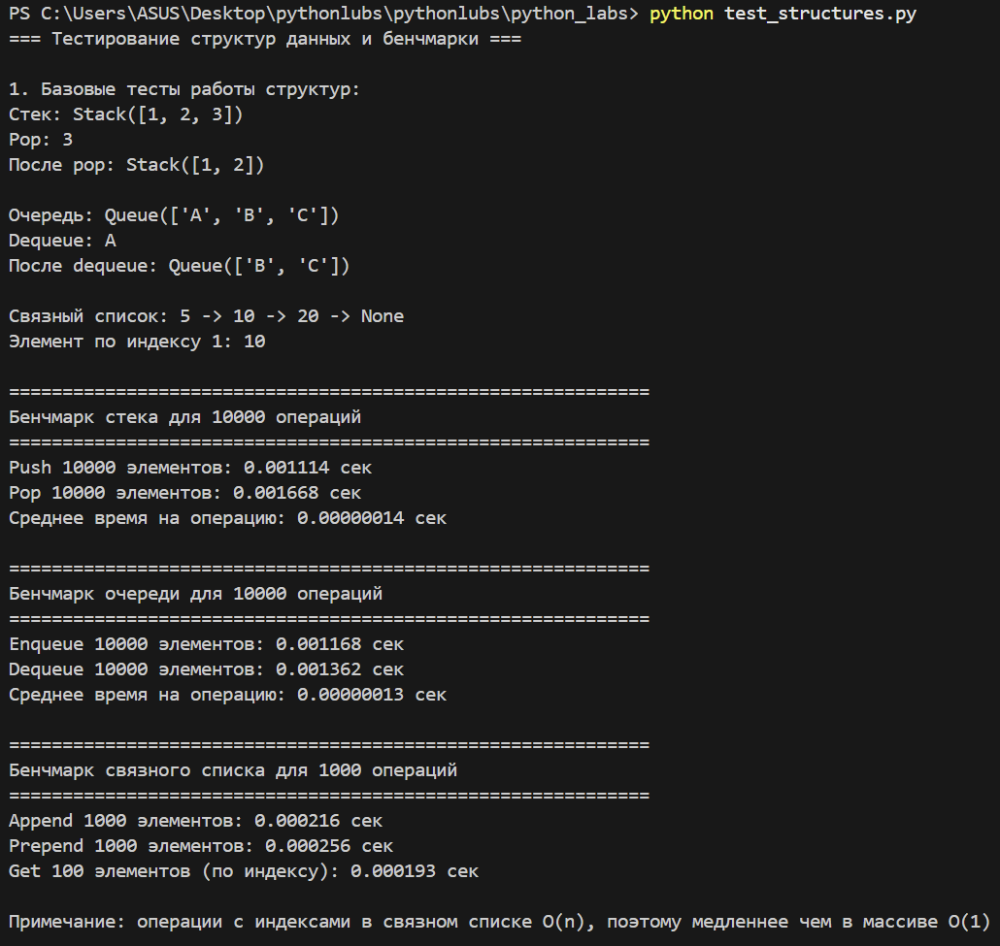
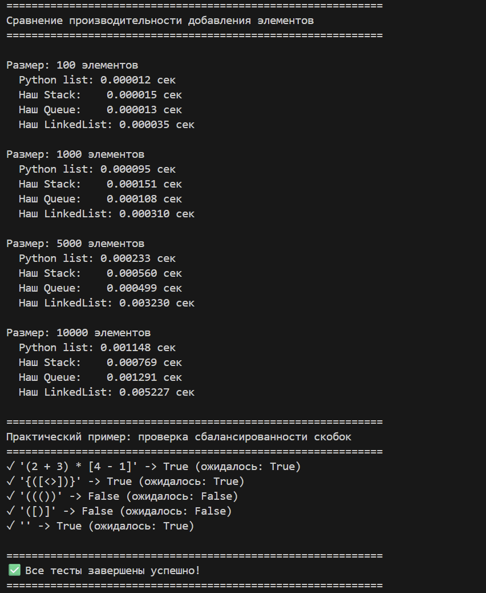
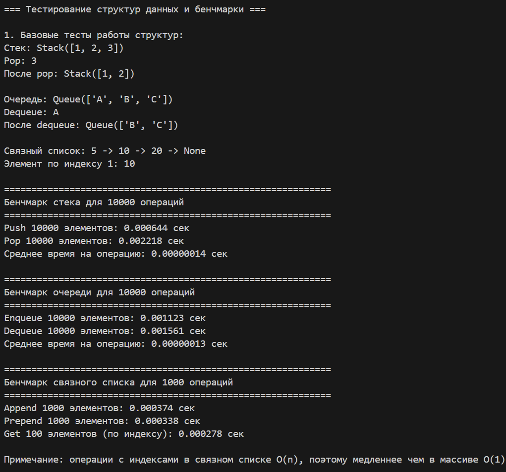
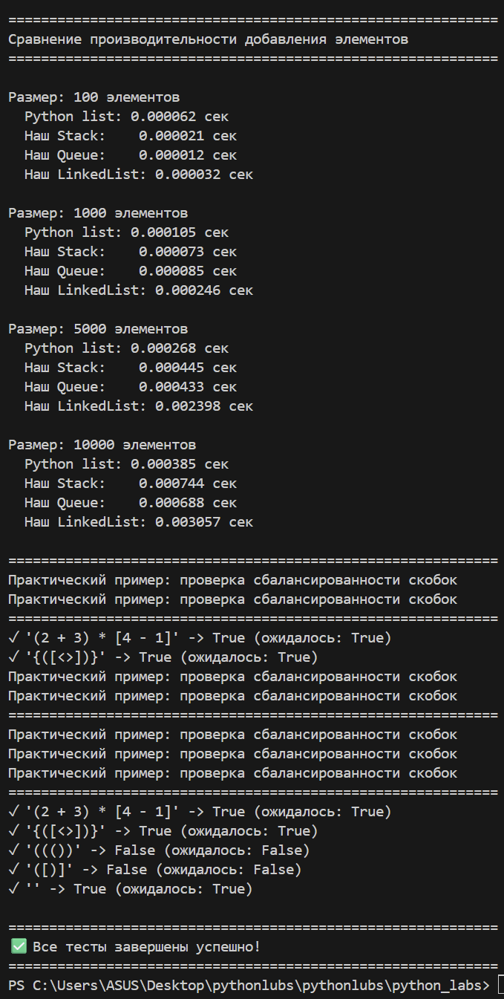

# python_labs
# Лабораторная работа №1
# Ввод/вывод и форматирование в Python

# Цель работы:
Освоить базовые операции ввода-вывода данных, работу с различными типами переменных и форматирование вывода в Python.

# Задание 1: Приветствие и возраст

**Файл:** `src/lab01/ex.01.py`  

**Цель:** Работа со строками и целыми числами, конкатенация строк.

**Ввод:**
- Имя (строка)
- Возраст (целое число)

**Вывод:**


**Пример:**
Имя: Алиса
Возраст: 19
Привет, Алиса! Через год тебе будет 20.# Задание 2: Сумма и среднее арифметическое

# Задание 2: Сумма и среднее

**Файл:** `src/lab01/ex.02.py`  

**Цель:** Работа с вещественными числами, форматирование вывода.

**Ввод:**
- Два вещественных числа (поддерживаются точка и запятая)

**Вывод:**


**Пример:**
a: 3,5
b: 4.25
sum=7.75; avg=3.88#   Задание 3: Расчет чека со скидкой и НДС

# Задание 3 — Чек: скидка и НДС

**Файл:** `src/lab01/ex.03.py`  

**Цель:** Применение математических формул, сложное форматирование вывода.

**Формулы:**
- `base = price * (1 - discount/100)`
- `vat_amount = base * (vat/100)`
- `total = base + vat_amount`

**Ввод:**
- Цена (вещественное)
- Скидка (%) (вещественное)
- НДС (%) (вещественное)

**Вывод:**


**Пример:**
price (₽): 1000
discount (%): 10
vat (%): 20#   Задание 4: Конвертер минут в часы и минуты

# Задание 4 — Минуты → ЧЧ:ММ

**Файл:** `src/lab01/ex.04.py`  

**Цель:** Работа с целочисленным делением, форматирование времени.

**Ввод:**
- Минуты (целое число)

**Вывод:**


**Пример:**
Минуты: 135
2:15

#   Задание 5: Инициалы и длина строки


**Файл:** `src/lab01/ex.05.py`
 
**Цель:** Работа со строками, методами строк, форматирование.

**Ввод:**

 ФИО одной строкой (могут быть лишние пробелы)

**Вывод:**


**Пример:**

ФИО: Хужамова Тасмина Музаффаровна
Инициалы: ХТМ.
Длина (символов): 29

## Задания со звездочкой

### Задание 6*

**Файл:** `src/lab01/ex.06.py`

**Цель:** Обработка ввода данных, работа с булевыми значениями, подсчет элементов.

**Ввод:**
Сначала число N, затем N строк, каждая формата:
Фамилия Имя Возраст Формат_участия

**Вывод:**
Два числа через пробел: количество участников очного формата и количество участников заочного формата.

**Пример:**

**Ввод:**
3

Максимов Максим 18 True

Геннадьев Геннадий 17 False

Алексеев Алексей 17 True

**Вывод:**


**Студент:** Хужамова Тасмина Музаффаровна 
**Группа:** [БИВТ-25-4]  
**Преподаватель:** []


# Лабораторная работа №2
# Коллекции и матрицы (list/tuple/set/dict)
# Цель работы:
Освоить операции над списками, кортежами, множествами и словарями. Научиться работать с 2D-списками (матрицами) — транспонирование, суммы по строкам/столбцам. Аккуратно форматировать текстовые представления записей (на примере студента).

# Задание 1: Операции со списками
**Файл:** `src/lab02/ex.01.py`

``` python
def min_max(nums: list[float | int]) -> tuple[float | int, float | int]:
    """
    Возвращает кортеж (минимум, максимум) из списка чисел.

    Args:
        nums: Список чисел (int или float)

    Returns:
        Кортеж (min, max)

    Raises:
        ValueError: Если список пуст
    """
    if not nums:
        raise ValueError("Список не может быть пустым")

    return min(nums), max(nums)


def unique_sorted(nums: list[float | int]) -> list[float | int]:
    """
    Возвращает отсортированный список уникальных значений.

    Args:
        nums: Список чисел (int или float)

    Returns:
        Отсортированный список уникальных значений
    """
    return sorted(set(nums))


def flatten(mat: list[list | tuple]) -> list:
    """
    "Расплющивает" список списков/кортежей в один список.

    Args:
        mat: Список, содержащий списки или кортежи

    Returns:
        Один список со всеми элементами

    Raises:
        TypeError: Если встретился элемент, не являющийся списком или кортежем

    extend:
    распаковывает элементы списка или кортежа, 
    добавляя в список result отдельные элементы каждого списка
    можно было использовать sublist вот так:
    result = [item for sublist in mat for item in sublist], 
    где часть   for sublist in mat  перебирает вложенные списки/кортежи, 
    а    for item in sublist   извлекает каждый элемент

    isinstance:
    проверяет, что item - спислк или кортеж, если нет, выводит TypError

    """
    result = []
    for item in mat:
        if not isinstance(item, (list, tuple)):
            raise TypeError("Все элементы должны быть списками или кортежами")
        result.extend(item) 
    return result

# Тест 1: нормальный случай
print("min_max([3, -1, 5, 5, 0]):", min_max([3, -1, 5, 5, 0]))

# Тест 2:ValueError
try:
    print("min_max([]):", min_max([]))
except ValueError as e:
    print(f"min_max([]): ValueError - {e}")

# Тест 3: уникальные значения
print("unique_sorted([3, 1, 2, 1, 3]):", unique_sorted([3, 1, 2, 1, 3]))

# Тест 4: нормальное расплющивание
print("flatten([[1, 2], [3, 4]]):", flatten([[1, 2], [3, 4]]))

# Тест 5: TypeError
try:
    print("flatten([1, [3, 4]]):", flatten([1, [3, 4]]))
except TypeError as e:
    print(f"flatten([1, [3, 4]]): TypeError - {e}")
```

**Вывод**


# Задание 2: Операции со списками

**Цель:** Поменять строки и столбцы местами. Пустая матрица [] → [].
Если матрица «рваная» (строки разной длины) — ValueError.

**Файл:** `src/lab02/задание B.2.py`

``` python
def _validate_rectangular(mat: list[list[float | int]]) -> None:
    """
    Проверяет, что матрица прямоугольная (все строки одинаковой длины).

    Args:
        mat: Матрица (список списков)

    Raises:
        ValueError: Если матрица рваная (строки разной длины)
    """
    if not mat:
        return []

    first_len = len(mat[0])
    for i, row in enumerate(mat):
        if len(row) != first_len:
            raise ValueError(f"Матрица рваная: строка {i} имеет длину {len(row)}, ожидалась {first_len}")


def transpose(mat: list[list[float | int]]) -> list[list[float | int]]:
    """
    Транспонирует матрицу (меняет строки и столбцы местами).

    Args:
        mat: Прямоугольная матрица

    Returns:
        Транспонированная матрица

    Raises:
        ValueError: Если матрица рваная
    """
    _validate_rectangular(mat)

    if not mat:
        return []

    return [[mat[i][j] for i in range(len(mat))] for j in range(len(mat[0]))]


def row_sums(mat: list[list[float | int]]) -> list[float]:
    """
    Вычисляет суммы по строкам матрицы.

    Args:
        mat: Прямоугольная матрица

    Returns:
        Список сумм по строкам

    Raises:
        ValueError: Если матрица рваная
    """
    _validate_rectangular(mat)

    return [sum(row) for row in mat]


def col_sums(mat: list[list[float | int]]) -> list[float]:
    """
    Вычисляет суммы по столбцам матрицы.

    Args:
        mat: Прямоугольная матрица

    Returns:
        Список сумм по столбцам

    Raises:
        ValueError: Если матрица рваная
    """
    _validate_rectangular(mat)

    if not mat:
        return []

    return [sum(mat[i][j] for i in range(len(mat))) for j in range(len(mat[0]))]

print("\n=== Matrix Tests ===")

# Тест 1: нормальное транспонирование
print("transpose([[1, 2, 3]]):", transpose([[1, 2, 3]]))  # [[1], [2], [3]]

# Тест 2: транспонирование рваной матрицы
try:
    print("transpose([[1, 2], [3]]):", transpose([[1, 2], [3]]))
except ValueError as e:
    print(f"transpose([[1, 2], [3]]): ValueError - {e}")

# Тест 3: транспонирование пустой матрицы
print("transpose([]):", transpose([]))  # []

# Тест 4: суммы по строкам
print("row_sums([[1, 2, 3], [4, 5, 6]]):", row_sums([[1, 2, 3], [4, 5, 6]]))  # [6, 15]

# Тест 5: суммы по строкам рваной матрицы
try:
    print("row_sums([[1, 2], [3]]):", row_sums([[1, 2], [3]]))
except ValueError as e:
    print(f"row_sums([[1, 2], [3]]): ValueError - {e}")

# Тест 6: суммы по столбцам
print("col_sums([[1, 2, 3], [4, 5, 6]]):", col_sums([[1, 2, 3], [4, 5, 6]]))  # [5, 7, 9]

# Тест 7: суммы по столбцам рваной матрицы
try:
    print("col_sums([[1, 2], [3]]):", col_sums([[1, 2], [3]]))
except ValueError as e:
    print(f"col_sums([[1, 2], [3]]): ValueError - {e}")

# Тест 8: дополнительные тесты
print("transpose([[1, 2], [3, 4]]):", transpose([[1, 2], [3, 4]]))  # [[1, 3], [2, 4]]
print("row_sums([[-1, 1], [10, -10]]):", row_sums([[-1, 1], [10, -10]]))  # [0, 0]
print("col_sums([[-1, 1], [10, -10]]):", col_sums([[-1, 1], [10, -10]]))  # [9, -9]
```
**Вывод:**


#   Задание C: tuples.py

**Файл:** `src/lab02/ex.03.py`

``` python
def format_record(rec: tuple[str, str, float]) -> str:
    """
    Форматирует запись студента в строку.

    Args:
        rec: Кортеж (ФИО, группа, GPA)

    Returns:
        Отформатированная строка вида "Фамилия И.О., гр. ГРУППА, GPA X.XX"

    Raises:
        ValueError: Если ФИО или группа пустые, или GPA отрицательный
        TypeError: Если неверные типы данных
    """
    if not isinstance(rec, tuple) or len(rec) != 3:
        raise TypeError("Запись должна быть кортежем из 3 элементов")

    fio, group, gpa = rec

    if not isinstance(fio, str) or not isinstance(group, str) or not isinstance(gpa, (int, float)):
        raise TypeError("Неверные типы данных: ожидались (str, str, float)")

    # Обработка ФИО
    fio_clean = ' '.join(fio.split()).title()  # Убираем лишние пробелы и делаем заглавные буквы
    fio_parts = fio_clean.split()

    if len(fio_parts) < 2:
        raise ValueError("ФИО должно содержать минимум фамилию и имя")

    if not fio_clean or not group:
        raise ValueError("ФИО и группа не могут быть пустыми")

    if gpa < 0:
        raise ValueError("GPA не может быть отрицательным")

    # Формируем инициалы
    surname = fio_parts[0]
    initials = '.'.join(name[0].upper() for name in fio_parts[1:]) + '.'

    # Форматируем GPA с 2 знаками после запятой
    gpa_formatted = f"{gpa:.2f}"

    return f"{surname} {initials}, гр. {group}, GPA {gpa_formatted}"
'''
print("\n=== Tuples Tests ===")
print(format_record(("Иванов Иван Иванович", "BIVT-25", 4.6)))  # "Иванов И.И., гр. BIVT-25, GPA 4.60"
print(format_record(("Петров Пётр", "IKBO-12", 5.0)))  # "Петров П., гр. IKBO-12, GPA 5.00"
'''
print("\n=== Tuples Tests ===")

# Тест 1: нормальный случай с отчеством
try:
    result = format_record(("Иванов Иван Иванович", "BIVT-25", 4.6))
    print(f"format_record(('Иванов Иван Иванович', 'BIVT-25', 4.6)): {result}")
except Exception as e:
    print(f"format_record(('Иванов Иван Иванович', 'BIVT-25', 4.6)): {type(e).__name__} - {e}")

# Тест 2: нормальный случай без отчества
try:
    result = format_record(("Петров Пётр", "IKBO-12", 5.0))
    print(f"format_record(('Петров Пётр', 'IKBO-12', 5.0)): {result}")
except Exception as e:
    print(f"format_record(('Петров Пётр', 'IKBO-12', 5.0)): {type(e).__name__} - {e}")

# Тест 3: нормальный случай с лишними пробелами
try:
    result = format_record(("    хужамова   тасмина   музаффаровна ", "ABB-01", 3.999))
    print(f"format_record(('  хужамова  тасмина  музаффаровна ', 'ABB-01', 3.999)): {result}")
except Exception as e:
    print(f"format_record(('  хужамова   тасмина   музаффаровна ', 'ABB-01', 3.999)): {type(e).__name__} - {e}")

# Тест 4: ошибка - пустое ФИО
try:
    result = format_record(("", "BIVT-25", 4.6))
    print(f"format_record(('', 'BIVT-25', 4.6)): {result}")
except Exception as e:
    print(f"format_record(('', 'BIVT-25', 4.6)): {type(e).__name__} - {e}")

# Тест 5: ошибка - пустая группа
try:
    result = format_record(("Иванов Иван", "", 4.6))
    print(f"format_record(('Иванов Иван', '', 4.6)): {result}")
except Exception as e:
    print(f"format_record(('Иванов Иван', '', 4.6)): {type(e).__name__} - {e}")

# Тест 6: ошибка - отрицательный GPA
try:
    result = format_record(("Иванов Иван", "BIVT-25", -1.0))
    print(f"format_record(('Иванов Иван', 'BIVT-25', -1.0)): {result}")
except Exception as e:
    print(f"format_record(('Иванов Иван', 'BIVT-25', -1.0)): {type(e).__name__} - {e}")

# Тест 7: ошибка - только фамилия
try:
    result = format_record(("Иванов", "BIVT-25", 4.6))
    print(f"format_record(('Иванов', 'BIVT-25', 4.6)): {result}")
except Exception as e:
    print(f"format_record(('Иванов', 'BIVT-25', 4.6)): {type(e).__name__} - {e}")


# Тест 8: ошибка - неверный тип GPA
try:
    result = format_record(("Иванов Иван", "BIVT-25", "4.6"))
    print(f"format_record(('Иванов Иван', 'BIVT-25', '4.6')): {result}")
except Exception as e:
    print(f"format_record(('Иванов Иван', 'BIVT-25', '4.6')): {type(e).__name__} - {e}")

# Тест 9: нормальный случай с округлением GPA
try:
    result = format_record(("Хужамова Тасмина", "IKBO-10", 3.456))
    print(f"format_record(('Хужамова Тасмина', 'IKBO-10', 3.456)): {result}")
except Exception as e:
    print(f"format_record(('Хужамова Тасмина', 'IKBO-10', 3.456)): {type(e).__name__} - {e}")
```

**Вывод:**


**Студент:** Хужамова Тасмина Музаффаровна
**Группа:** [БИВТ-25-4]  
**Преподаватель:** [Замурагин И.М.]


# Лабораторная работа №3
## Тексты и частоты слов (словарь/множество)
## Цель: 
Нормализовать текст, аккуратно токенизировать, посчитать частоты слов и вывести топ-N.

## Задание A (1.normalaize, 2.tokenize, 3.count_freq, 4.top_n):

**Файл:** `src/lab03/normalaize.py`

```python
def normalize(text: str, *, casefold: bool = True, yo2e: bool = True) -> str:
    """
    Нормализует текст: приводит регистр, заменяет ё на е, убирает лишние пробелы.
    
    Args:
        text: Исходный текст
        casefold: Приводить к нижнему регистру (по умолчанию True)
        yo2e: Заменять ё/Ё на е/Е (по умолчанию True)
        
    Returns:
        Нормализованный текст
    """
    if casefold==True:
        text=text.casefold()

    if yo2e==True:
        text=text.replace("ё","е").replace("Ё","Е")

    for char in ['\t', '\r', '\n']:
        text = text.replace(char, ' ')
        
    text=text.split()
    text=" ".join(text)
    return text

print("=== Тесты текста ===")
texts = [
    "Hello\r\nWorld",
    "ПрИвЕт\nМИр\t", 
    "ёжик, Ёлка",
    "  двойные   пробелы  ",
    "привет, мир! как дела?"
]

for text in texts:
    result = normalize(text)
    print(result)
```

**Вывод:** 


**Файл:** `src/lab03/tokenize.py`

``` python
import re


def tokenize(text: str) -> list[str]:
    """
    Разбивает текст на слова (токены).

    Находит последовательности букв, цифр, подчеркиваний,
    может содержать дефисы внутри слов.

    Args:
        text: Текст для разбиения на слова

    Returns:
        Список найденных слов
    """
    # Регулярное выражение для поиска слов
    # [\w]+    - одна или больше букв/цифр/подчеркиваний
    # (?:-[\w]+)* - ноль или больше повторов: дефис + буквы/цифры
    pattern = r"[\w]+(?:-[\w]+)*"

    # Находим все совпадения с шаблоном
    tokens = re.findall(pattern, text)

    return tokens

print("=== Тесты текста ===")
texts = [
    "привет мир",
    "hello,world!!!", 
    "по-настоящему круто",
    "2025 год",
    "emoji 🐈‍⬛ не слово"
]

for text in texts:
    result = tokenize(text)
    print(result)
```

**Вывод:** 


**Файл:** `src/lab02/задание B.3.py`

``` python


def count_freq(tokens: list[str]) -> dict[str, int]:
    """
    Подсчитывает, сколько раз каждое слово встречается в списке.

    Args:
        tokens: Список слов для подсчета

    Returns:
        Словарь, где ключ - слово, значение - количество вхождений

    Examples:
        >>> count_freq(["яблоко", "банан", "яблоко"])
        {'яблоко': 2, 'банан': 1}

        >>> count_freq(["да", "нет", "да", "может быть"])
        {'да': 2, 'нет': 1, 'может быть': 1}
    """
    # Создаем пустой словарь для результатов
    frequency_dict = {}

    # Проходим по каждому слову в списке
    for word in tokens:
        if word not in frequency_dict:
            # Если слова еще нет - добавляем со счетчиком 1
            frequency_dict[word] = 1
        else:
            # Если слово уже есть - увеличиваем счетчик на 1
            frequency_dict[word] += 1

    return frequency_dict

def top_n(freq: dict[str, int], n: int = 5) -> list[tuple[str, int]]: 
    """Возвращает n наиболее часто встречающихся 
    элементов из словаря частот.

    Args:
        freq: Словарь, где ключи - это элементы (например, слова), 
        а значения - их частота встречаемости

        n: количество самых частовстречающихся элементов, которые нужно вернуть.
        По умолчанию равно 5.

    Returns:
        list[tuple[str, int]]: Список из `n` кортежей, 
        каждый из которых содержит элемент
        (строку) и его частоту (целое число), 
        отсротированные в порядке убывания частоты.
    
    """
    # Преобразуем словарь в список кортежей
    items = list(freq.items())

    # Сортируем по убыванию частоты, при равенстве - по алфавиту.lambda - ключ для сортировки по частотеб 
    sorted_items = sorted(items,  key=lambda x: (-x[1], x[0]))

    # Возвращаем первые n элементов
    return sorted_items[:n]

print("=== Тесты списка/словаря №1===")
tokens = ["a","b","a","c","b","a"]
result_for_count=count_freq(tokens)
result_for_top=top_n(result_for_count, n=2)
print("Словарь частот:", result_for_count)
print("Топ-2 слов:", result_for_top)


print("=== Тесты списка/словаря №2===")
tokens = ["bb","aa","bb","aa","cc"]
result_for_count=count_freq(tokens)
result_for_top=top_n(result_for_count, n=2)
print("Словарь частот:", result_for_count)
print("Топ-2 слов:", result_for_top)

```

**Вывод:**


# Задание test_stats

# Ввод:

``` python
#!/usr/bin/env python3
"""
text_stats.py - скрипт для анализа текстовой статистики
ЛР3 — Тексты и частоты слов
Студент: Хужамова Тасмина Музаффаровна
Группа: БИВТ-25-4
"""

import sys
import os

# Добавляем путь для импорта наших модулей
sys.path.append(os.path.join(os.path.dirname(__file__), '..', 'lib'))

# Импортируем наши функции из библиотеки
from text import normalize, tokenize, count_freq, top_n


def text_stats(text: str, table_mode: bool = False) -> None:
    """
    Анализирует текст и выводит статистику по словам.
    
    Args:
        text: Исходный текст для анализа
        table_mode: Если True, выводит результаты в виде таблицы
    """
    # Проверяем, что текст не пустой
    if not text or not text.strip():
        print("Ошибка: текст пустой или содержит только пробелы")
        return
    
    # 1. Нормализуем текст (приводим к нижнему регистру, убираем лишние пробелы)
    norm_text = normalize(text)
    
    # 2. Разбиваем на отдельные слова (токены)
    tokens = tokenize(norm_text)
    
    # 3. Подсчитываем частоту каждого слова
    freq = count_freq(tokens)
    
    # 4. Получаем статистику
    total_words = len(tokens)
    unique_words = len(freq)
    top_words = top_n(freq, n=5)
    
    # 5. Выводим результаты
    print(f'Всего слов: {total_words}')
    print(f'Уникальных слов: {unique_words}')
    print('Топ-5:')
    
    if table_mode:
        print_table_output(top_words)
    else:
        print_simple_output(top_words)


def print_simple_output(top_words):
    """
    Простой вывод топ-слов в формате 'слово:частота'
    
    Args:
        top_words: Список кортежей (слово, частота)
    """
    for word, count in top_words:
        print(f'{word}:{count}')


def print_table_output(top_words):
    """
    Красиво выровненный табличный вывод
    
    Args:
        top_words: Список кортежей (слово, частота)
    """
    if not top_words:
        print("Нет данных для отображения")
        return
    
    # Находим максимальную длину слова для красивого выравнивания
    max_word_len = max(len(word) for word, _ in top_words)
    
    # Заголовок таблицы
    header = "слово".ljust(max_word_len) + " | частота"
    separator = "-" * len(header)
    
    print(header)
    print(separator)
    
    # Выводим данные таблицы
    for word, count in top_words:
        print(f"{word.ljust(max_word_len)} | {count}")


def get_input_text():
    """
    Получает текст от пользователя разными способами
    
    Returns:
        Введенный текст
    """
    # Проверяем, есть ли данные в stdin (pipe или перенаправление)
    if not sys.stdin.isatty():  # Если данные приходят через pipe или перенаправление
        return sys.stdin.read().strip()
    
    # Проверяем, есть ли аргументы командной строки
    if len(sys.argv) > 1 and not sys.argv[1].startswith('--'):
        # Читаем из файла: python text_stats.py filename.txt
        try:
            with open(sys.argv[1], 'r', encoding='utf-8') as f:
                return f.read()
        except FileNotFoundError:
            print(f"Ошибка: файл {sys.argv[1]} не найден")
            return None
    else:
        # Интерактивный ввод
        print("Введите текст для анализа (можно несколько строк):")
        print("Для завершения ввода нажмите Ctrl+D (Linux/Mac) или Ctrl+Z (Windows):")
        
        try:
            return sys.stdin.read().strip()
        except EOFError:
            print("\nВвод завершен.")
            return None


def main():
    """
    Основная функция - получает текст и запускает анализ
    """
    # Проверяем, включен ли табличный режим
    table_mode = '--table' in sys.argv or os.getenv('TEXT_STATS_TABLE', '0') == '1'
    
    # Получаем текст
    text = get_input_text()
    
    if not text:
        print("Ошибка: текст не может быть пустым")
        return
    
    # Запускаем анализ
    text_stats(text, table_mode)


if __name__ == '__main__':
    main()
```

# Вывод


# Лабораторная работа №4
## задание А

**Файл text_report:**
``` python
#!/usr/bin/env python3
"""
text_report.py - скрипт для генерации отчетов по текстовой статистике
ЛР4 — Файлы: TXT/CSV и отчёты

Этот скрипт анализирует текстовые файлы: подсчитывает сколько раз каждое слово встречается,
и сохраняет результаты в CSV файл. Также показывает статистику в консоли.

Пример использования:
    python src/lab04/text_report.py                    # Базовая версия
    python src/lab04/text_report.py --table            # С красивой таблицей
    python src/lab04/text_report.py --input my.txt     # Свои файлы
"""

# Импортируем стандартные модули Python
import sys        # Для работы с системными функциями (выход из программы)
import argparse   # Для обработки аргументов командной строки (--input, --output и т.д.)
from pathlib import Path  # Для удобной работы с путями файлов и папок

"""
ВНИМАНИЕ: следующий блок кода нужен чтобы Python мог найти наши собственные модули
в папке src/lib/ и src/lab04/
"""
# Получаем путь к родительской папке (src/) и добавляем его в sys.path
# Это нужно чтобы импортировать наши собственные модули
sys.path.append(str(Path(__file__).parent.parent))

# Импортируем наши собственные функции из других файлов
from lib.text import normalize, tokenize, count_freq, top_n        # Функции из ЛР3 для работы с текстом
from lab04.io_txt_csv import read_text, write_csv                 # Функции из этой ЛР для работы с файлами


def print_table_output(top_words: list[tuple[str, int]]) -> None:
    """
    Выводит красивую таблицу с результатами в консоль.
    
    Эта функция берет список слов с частотами и выводит их в виде аккуратной таблицы
    с выровненными колонками.
    
    Args:
        top_words (list[tuple[str, int]]): Список кортежей в формате (слово, частота)
            Пример: [('привет', 2), ('мир', 1), ('текст', 1)]
    
    Returns:
        None: Функция только печатает в консоль, ничего не возвращает
    
    Пример вывода:
        слово      | частота
        -------------------
        привет     | 2
        мир        | 1
        текст      | 1
    """
    # Проверяем, есть ли данные для вывода
    if not top_words:
        print("Нет данных для отображения")
        return
    
    """
    Шаг 1: Находим самую длинную строку среди всех слов
    Это нужно чтобы сделать красивую таблицу с ровными колонками
    """
    # Проходим по всем словам и находим максимальную длину
    max_word_len = max(len(word) for word, _ in top_words)
    
    """
    Шаг 2: Создаем заголовок таблицы
    ljust() добавляет пробелы справа до нужной длины, чтобы выровнять текст
    """
    header = "слово".ljust(max_word_len) + " | частота"
    
    # Создаем разделительную линию под заголовком
    separator = "-" * len(header)  # Строка из символов '-' той же длины что и заголовок
    
    """
    Шаг 3: Выводим таблицу
    """
    print(header)      # Заголовок: "слово      | частота"
    print(separator)   # Разделитель: "-------------------"
    
    # Выводим каждую строку данных
    for word, count in top_words:
        # ljust() выравнивает слово по левому краю, добавляя пробелы справа
        print(f"{word.ljust(max_word_len)} | {count}")


def analyze_text(text: str) -> tuple[int, int, list[tuple[str, int]]]:
    """
    Анализирует текст и возвращает статистику по словам.
    
    Эта функция является "сердцем" программы - она принимает текст и возвращает
    всю необходимую статистику: общее количество слов, количество уникальных слов,
    и список самых частых слов.
    
    Args:
        text (str): Исходный текст для анализа
        
    Returns:
        tuple: Кортеж из трех элементов:
            - total_words (int): Общее количество слов в тексте
            - unique_words (int): Количество уникальных слов (без повторений)
            - top_words (list): Список кортежей (слово, частота) для топ-5 слов
    
    Процесс анализа:
        1. Нормализация: приводим текст к нижнему регистру, убираем лишние пробелы
        2. Токенизация: разбиваем текст на отдельные слова
        3. Подсчет частот: считаем сколько раз каждое слово встречается
        4. Сортировка: находим 5 самых частых слов
    """
    # Шаг 1: Нормализуем текст (приводим к нижнему регистру, убираем лишние пробелы)
    normalized_text = normalize(text)
    
    # Шаг 2: Разбиваем нормализованный текст на отдельные слова (токены)
    tokens = tokenize(normalized_text)
    
    # Шаг 3: Подсчитываем частоту каждого слова (сколько раз встречается)
    frequency_dict = count_freq(tokens)
    
    # Шаг 4: Находим 5 самых частых слов
    top_5_words = top_n(frequency_dict, 5)
    
    # Возвращаем результаты
    total_word_count = len(tokens)           # Всего слов (с повторениями)
    unique_word_count = len(frequency_dict)  # Уникальных слов (без повторений)
    
    return total_word_count, unique_word_count, top_5_words


def generate_report(input_file: str, output_file: str, encoding: str = "utf-8", table_output: bool = False) -> None:
    """
    Основная функция генерации отчета - координирует всю работу.
    
    Эта функция:
      1. Читает текст из файла
      2. Анализирует его
      3. Сохраняет полные результаты в CSV
      4. Выводит краткую статистику в консоль
    
    Args:
        input_file (str): Путь к файлу с текстом для анализа
        output_file (str): Путь куда сохранить CSV отчет
        encoding (str): Кодировка входного файла (utf-8, cp1251 и т.д.)
        table_output (bool): Если True - выводит красивую таблицу, иначе простой список
    
    Raises:
        FileNotFoundError: Если входной файл не существует
        UnicodeDecodeError: Если неправильно указана кодировка файла
    """
    try:
        """
        БЛОК 1: ЧТЕНИЕ ФАЙЛА
        """
        print(f"Читаем файл: {input_file}")
        text_content = read_text(input_file, encoding)
        
        # Проверяем что файл не пустой
        if not text_content.strip():
            print("Внимание: файл пустой или содержит только пробелы")
        
        """
        БЛОК 2: АНАЛИЗ ТЕКСТА
        """
        print("Анализируем текст...")
        total_words, unique_words, top_words = analyze_text(text_content)
        
        """
        БЛОК 3: ПОДГОТОВКА ДАННЫХ ДЛЯ CSV
        Здесь мы заново получаем частоты всех слов и сортируем их
        для сохранения в CSV файл
        """
        # Получаем частоты всех слов (не только топ-5)
        all_frequencies = count_freq(tokenize(normalize(text_content)))
        
        # Сортируем слова по убыванию частоты, при равенстве - по алфавиту
        sorted_all_words = sorted(all_frequencies.items(), key=lambda x: (-x[1], x[0]))
        
        # Преобразуем в формат для CSV: список кортежей (слово, количество)
        csv_data = [(word, count) for word, count in sorted_all_words]
        
        """
        БЛОК 4: СОХРАНЕНИЕ CSV ОТЧЕТА
        """
        print(f"Сохраняем отчет...")
        write_csv(csv_data, output_file, header=("word", "count"))
        
        """
        БЛОК 5: ВЫВОД СТАТИСТИКИ В КОНСОЛЬ
        """
        print("\nРЕЗУЛЬТАТЫ АНАЛИЗА:")
        print(f"   Всего слов: {total_words}")
        print(f"   Уникальных слов: {unique_words}")
        print("   Топ-5 самых частых слов:")
        
        if table_output:
            # ВЫВОД В ВИДЕ КРАСИВОЙ ТАБЛИЦЫ
            print_table_output(top_words)
        else:
            # ПРОСТОЙ ВЫВОД (как было раньше)
            for word, count in top_words:
                print(f"   {word}: {count}")
            
        print(f"\nПолный отчет сохранен в: {output_file}")
        
    except FileNotFoundError:
        # Обработка ошибки: файл не найден
        print(f"Ошибка: файл '{input_file}' не найден!")
        print("   Проверьте путь к файлу и его наличие")
        sys.exit(1)  # Завершаем программу с кодом ошибки 1
        
    except UnicodeDecodeError:
        # Обработка ошибки: неправильная кодировка
        print(f"Ошибка: не удалось прочитать файл '{input_file}' в кодировке '{encoding}'")
        print("   Возможные решения:")
        print("   - Укажите правильную кодировку: --encoding cp1251")
        print("   - Преобразуйте файл в UTF-8")
        sys.exit(1)  # Завершаем программу с кодом ошибки 1


def main() -> None:
    """
    Главная функция программы - точка входа.
    
    Эта функция:
      1. Настраивает парсер аргументов командной строки
      2. Читает аргументы которые ввел пользователь
      3. Запускает процесс генерации отчета
    
    Аргументы командной строки:
      --input, -i    : Путь к входному файлу
      --output, -o   : Путь для сохранения отчета  
      --encoding, -e : Кодировка файла
      --table, -t    : Включить красивый табличный вывод
    """
    """
    Шаг 1: СОЗДАЕМ ПАРСЕР АРГУМЕНТОВ
    ArgumentParser - это "умный" обработчик который сам генерирует справку
    и проверяет правильность аргументов
    """
    parser = argparse.ArgumentParser(
        description="Анализирует текстовый файл и генерирует отчет о частоте слов",
        epilog="Примеры использования:\n"
               "  python text_report.py                    # Базовая версия\n"
               "  python text_report.py --table            # С красивой таблицей\n"
               "  python text_report.py -i story.txt -t    # Анализ story.txt с таблицей"
    )
    
    """
    Шаг 2: ДОБАВЛЯЕМ АРГУМЕНТЫ
    Каждый add_argument добавляет один параметр который можно указать в командной строке
    """
    
    # Аргумент для входного файла
    parser.add_argument(
        '--input',                   # Длинное имя: --input
        '-i',                        # Короткое имя: -i
        default='data/lab04/input.txt',  # Значение по умолчанию если аргумент не указан
        help='Путь к файлу с текстом для анализа'  # Описание для справки
    )
    
    # Аргумент для выходного файла
    parser.add_argument(
        '--output', 
        '-o',
        default='data/lab04/report.csv',
        help='Путь для сохранения CSV отчета с полной статистикой'
    )
    
    # Аргумент для кодировки файла
    parser.add_argument(
        '--encoding',
        '-e', 
        default='utf-8',
        help='Кодировка входного файла (utf-8, cp1251, koi8-r и т.д.)'
    )
    
    # Аргумент для табличного вывода (флаг - либо есть, либо нет)
    parser.add_argument(
        '--table',
        '-t',
        action='store_true',  # Особый тип аргумента - флаг (True если указан, False если нет)
        help='Выводить топ-5 слов в виде красивой таблицы'
    )
    
    """
    Шаг 3: ЧИТАЕМ АРГУМЕНТЫ ИЗ КОМАНДНОЙ СТРОКИ
    parse_args() анализирует sys.argv (аргументы которые передали при запуске)
    и возвращает объект с значениями всех аргументов
    """
    args = parser.parse_args()
    
    """
    Шаг 4: ЗАПУСКАЕМ ГЕНЕРАЦИЮ ОТЧЕТА
    Передаем все аргументы в основную функцию
    """
    print("Запуск анализа текста...")
    print(f"   Входной файл: {args.input}")
    print(f"   Выходной файл: {args.output}") 
    print(f"   Кодировка: {args.encoding}")
    print(f"   Табличный вывод: {'ВКЛЮЧЕН' if args.table else 'выключен'}")
    print()
    
    generate_report(args.input, args.output, args.encoding, args.table)


"""
ЭТА СТРОКА ОЧЕНЬ ВАЖНА!
Она означает: "запускать функцию main() только если этот файл запущен напрямую,
а не импортирован как модуль в другой программе"

Это стандартная практика в Python - она позволяет использовать файл и как скрипт,
и как модуль который можно импортировать в других программах
"""
if __name__ == "__main__":
    main()
```

**Файл io_txt_csv:**
``` python
"""
Модуль для работы с текстовыми и CSV файлами.
ЛР4 — Файлы: TXT/CSV и отчёты
"""

import csv
from pathlib import Path
from typing import Union, Iterable, Sequence


def read_text(path: Union[str, Path], encoding: str = "utf-8") -> str:
    """
    Читает текстовый файл и возвращает его содержимое как строку.
    
    Args:
        path: Путь к файлу (строка или Path объект)
        encoding: Кодировка файла (по умолчанию UTF-8)
        
    Returns:
        Содержимое файла как строка
        
    Raises:
        FileNotFoundError: Если файл не существует
        UnicodeDecodeError: Если неправильная кодировка
        
    Examples:
        >>> text = read_text("data/input.txt")
        >>> text = read_text("data/file.txt", encoding="cp1251")
    """
    # Преобразуем в Path объект для удобства
    file_path = Path(path)
    
    # Читаем файл с указанной кодировкой
    # Если файла нет - выбросится FileNotFoundError
    # Если кодировка неправильная - UnicodeDecodeError
    return file_path.read_text(encoding=encoding)


def write_csv(rows: Iterable[Sequence], path: Union[str, Path], 
              header: tuple[str, ...] = None) -> None:
    """
    Записывает данные в CSV файл.
    
    Args:
        rows: Итерируемый объект со строками данных
        path: Путь для сохранения CSV файла
        header: Заголовок таблицы (опционально)
        
    Raises:
        ValueError: Если строки имеют разную длину
        
    Examples:
        >>> data = [("word", "count"), ("привет", 2)]
        >>> write_csv(data, "report.csv", header=("word", "count"))
    """
    file_path = Path(path)
    rows_list = list(rows)  # Преобразуем в список для проверки
    
    # Проверяем, что все строки одинаковой длины
    if rows_list:
        first_len = len(rows_list[0])
        for i, row in enumerate(rows_list):
            if len(row) != first_len:
                raise ValueError(f"Строка {i} имеет длину {len(row)}, ожидалась {first_len}")
    
    # Создаем родительские папки если их нет
    file_path.parent.mkdir(parents=True, exist_ok=True)
    
    # Записываем в CSV
    with file_path.open('w', encoding='utf-8', newline='') as file:
        writer = csv.writer(file)
        
        # Записываем заголовок если есть
        if header is not None:
            writer.writerow(header)
        
        # Записываем данные
        for row in rows_list:
            writer.writerow(row)


def ensure_parent_dir(path: Union[str, Path]) -> None:
    """
    Создает родительские директории если их нет.
    
    Args:
        path: Путь к файлу или директории
        
    Examples:
        >>> ensure_parent_dir("data/reports/final.csv")
        # Создаст папки data/ и data/reports/ если их нет
    """
    file_path = Path(path)
    file_path.parent.mkdir(parents=True, exist_ok=True)
```

# Тесты и выводы

**Обычный вывод**


**Табличный вывод**


**Вывод для файла а**


**Вывод для файла b**


**Тест ошибок**


**Вывод справки - help**


# Лабораторная работа №5
## JSON и конвертации (JSON↔CSV, CSV→XLSX): Техническое задание
**Цель:**
Разобраться с форматом JSON, сериализацией/десериализацией и табличными конвертациями

**Файл:** json_csv.py

``` python
"""
Модуль для конвертации между JSON и CSV форматами.
ЛР5 — JSON и конвертации
"""

import json
import csv
from pathlib import Path


def json_to_csv(json_path: str, csv_path: str) -> None:
    """
    Конвертирует JSON файл в CSV формат.
    
    Поддерживает JSON файлы содержащие список словарей.
    Например: [{"name": "Alice", "age": 25}, {"name": "Bob", "age": 30}]
    
    Args:
        json_path: Путь к исходному JSON файлу
        csv_path: Путь для сохранения CSV файла
        
    Raises:
        FileNotFoundError: Если JSON файл не существует
        ValueError: Если JSON пустой, не список или содержит не словари
    """
    # Преобразуем пути в Path объекты
    json_file = Path(json_path)
    csv_file = Path(csv_path)
    
    # Проверяем существование JSON файла
    if not json_file.exists():
        raise FileNotFoundError(f"JSON файл не найден: {json_path}")
    
    # Читаем JSON файл
    with json_file.open('r', encoding='utf-8') as jf:
        try:
            data = json.load(jf)
        except json.JSONDecodeError as e:
            raise ValueError(f"Ошибка чтения JSON: {e}")
    
    # Валидация данных
    if not data:
        raise ValueError("Пустой JSON файл")
    
    if not isinstance(data, list):
        raise ValueError("JSON должен содержать список")
    
    if not all(isinstance(item, dict) for item in data):
        raise ValueError("Все элементы JSON должны быть словарями")
    
    # Создаем родительские папки если их нет
    csv_file.parent.mkdir(parents=True, exist_ok=True)
    
    # Получаем все уникальные ключи из всех словарей
    all_keys = set()
    for item in data:
        all_keys.update(item.keys())
    
    # Сортируем ключи по алфавиту для единообразия
    fieldnames = sorted(all_keys)
    
    # Записываем CSV
    with csv_file.open('w', encoding='utf-8', newline='') as cf:
        writer = csv.DictWriter(cf, fieldnames=fieldnames)
        writer.writeheader()
        
        for item in data:
            # Заполняем отсутствующие поля пустыми строками
            row = {key: item.get(key, '') for key in fieldnames}
            writer.writerow(row)


def csv_to_json(csv_path: str, json_path: str) -> None:
    """
    Конвертирует CSV файл в JSON формат.
    
    Преобразует CSV в список словарей, где первая строка - заголовки.
    
    Args:
        csv_path: Путь к исходному CSV файлу
        json_path: Путь для сохранения JSON файла
        
    Raises:
        FileNotFoundError: Если CSV файл не существует
        ValueError: Если CSV файл пустой или не имеет заголовка
    """
    # Преобразуем пути в Path объекты
    csv_file = Path(csv_path)
    json_file = Path(json_path)
    
    # Проверяем существование CSV файла
    if not csv_file.exists():
        raise FileNotFoundError(f"CSV файл не найден: {csv_path}")
    
    # Читаем CSV файл
    with csv_file.open('r', encoding='utf-8') as cf:
        reader = csv.DictReader(cf)
        
        # Преобразуем в список
        data = list(reader)
    
    # Валидация данных
    if not data:
        raise ValueError("CSV файл пустой или не содержит данных")
    
    # Создаем родительские папки если их нет
    json_file.parent.mkdir(parents=True, exist_ok=True)
    
    # Записываем JSON
    with json_file.open('w', encoding='utf-8') as jf:
        json.dump(data, jf, ensure_ascii=False, indent=2)

```
**Вывод:**


**Вывод:**


**Файл:** csv_xlsx.py

``` python
"""
Модуль для конвертации CSV в XLSX формат.
ЛР5 — JSON и конвертации
"""

import csv
from pathlib import Path

# Импортируем openpyxl (внешняя библиотека)
try:
    from openpyxl import Workbook
    from openpyxl.utils import get_column_letter
except ImportError:
    raise ImportError("Для работы этого модуля установите openpyxl: pip install openpyxl")


def csv_to_xlsx(csv_path: str, xlsx_path: str) -> None:
    """
    Конвертирует CSV файл в XLSX формат (Excel).
    
    Автоматически подбирает ширину колонок по содержимому.
    
    Args:
        csv_path: Путь к исходному CSV файлу
        xlsx_path: Путь для сохранения XLSX файла
        
    Raises:
        FileNotFoundError: Если CSV файл не существует
        ValueError: Если CSV файл пустой
    """
    # Преобразуем пути в Path объекты
    csv_file = Path(csv_path)
    xlsx_file = Path(xlsx_path)
    
    # Проверяем существование CSV файла
    if not csv_file.exists():
        raise FileNotFoundError(f"CSV файл не найден: {csv_path}")
    
    # Читаем CSV файл
    with csv_file.open('r', encoding='utf-8') as cf:
        reader = csv.reader(cf)
        rows = list(reader)
    
    # Валидация данных
    if not rows:
        raise ValueError("CSV файл пустой")
    
    # Создаем родительские папки если их нет
    xlsx_file.parent.mkdir(parents=True, exist_ok=True)
    
    # Создаем новую книгу Excel
    workbook = Workbook()
    sheet = workbook.active
    sheet.title = "Sheet1"
    
    # Записываем данные из CSV в Excel
    for row in rows:
        sheet.append(row)
    
    # Настраиваем авто-ширину колонок
    for column_cells in sheet.columns:
        # Получаем максимальную длину текста в колонке
        max_length = 0
        column_letter = get_column_letter(column_cells[0].column)
        
        for cell in column_cells:
            try:
                # Проверяем длину текста в ячейке
                if len(str(cell.value)) > max_length:
                    max_length = len(str(cell.value))
            except:
                pass
        
        # Устанавливаем ширину колонки (минимум 8 символов)
        adjusted_width = max(max_length + 2, 8)
        sheet.column_dimensions[column_letter].width = adjusted_width
    
    # Сохраняем XLSX файл
    workbook.save(xlsx_file)

```
**Вывод:**


**Расположение файлов и папок в системе:**


# Лабораторная работа №6
## cli_convert:
``` python
"""
Командный интерфейс для конвертации данных между форматами.

Модуль предоставляет CLI-команды для конвертации:
- json2csv: JSON → CSV
- csv2json: CSV → JSON  
- csv2xlsx: CSV → XLSX

Использование:
    python -m src.lab06.cli_convert <команда> --in <входной_файл> --out <выходной_файл>

Примеры:
    python -m src.lab06.cli_convert json2csv --in data/samples/people.json --out data/out/people.csv
    python -m src.lab06.cli_convert csv2json --in data/samples/people.csv --out data/out/people.json
    python -m src.lab06.cli_convert csv2xlsx --in data/samples/people.csv --out data/out/people.xlsx
"""

import argparse
import sys
from pathlib import Path


def main():
    """
    Основная функция CLI-конвертера.
    
    Обрабатывает аргументы командной строки и вызывает соответствующие
    функции конвертации из модуля lab05.
    """
    # Создаем парсер аргументов с описанием программы
    parser = argparse.ArgumentParser(
        description="Конвертер данных между форматами JSON, CSV, XLSX",
        epilog="Примеры использования:\n"
               "  python -m src.lab06.cli_convert json2csv --in input.json --out output.csv\n"
               "  python -m src.lab06.cli_convert csv2json --in input.csv --out output.json\n"
               "  python -m src.lab06.cli_convert csv2xlsx --in input.csv --out output.xlsx"
    )
    
    # Добавляем подпарсеры для разных команд
    subparsers = parser.add_subparsers(
        dest="command", 
        help="Доступные команды конвертации"
    )
    
    # Команда json2csv
    json2csv_parser = subparsers.add_parser(
        "json2csv", 
        help="Конвертировать JSON файл в CSV формат"
    )
    json2csv_parser.add_argument(
        "--in", 
        dest="input", 
        required=True,
        help="Путь к входному JSON файлу (например: data/samples/people.json)"
    )
    json2csv_parser.add_argument(
        "--out", 
        dest="output", 
        required=True,
        help="Путь для сохранения CSV файла (например: data/out/people.csv)"
    )
    
    # Команда csv2json
    csv2json_parser = subparsers.add_parser(
        "csv2json", 
        help="Конвертировать CSV файл в JSON формат"
    )
    csv2json_parser.add_argument(
        "--in", 
        dest="input", 
        required=True,
        help="Путь к входному CSV файлу (например: data/samples/people.csv)"
    )
    csv2json_parser.add_argument(
        "--out", 
        dest="output", 
        required=True,
        help="Путь для сохранения JSON файла (например: data/out/people.json)"
    )
    
    # Команда csv2xlsx
    csv2xlsx_parser = subparsers.add_parser(
        "csv2xlsx", 
        help="Конвертировать CSV файл в Excel (XLSX) формат"
    )
    csv2xlsx_parser.add_argument(
        "--in", 
        dest="input", 
        required=True,
        help="Путь к входному CSV файлу (например: data/samples/people.csv)"
    )
    csv2xlsx_parser.add_argument(
        "--out", 
        dest="output", 
        required=True,
        help="Путь для сохранения XLSX файла (например: data/out/people.xlsx)"
    )
    
    # Парсим аргументы командной строки
    args = parser.parse_args()
    
    # Если команда не указана, выводим справку
    if not args.command:
        parser.print_help()
        return
    
    try:
        # Выполняем соответствующую команду
        if args.command == "json2csv":
            from src.lab05.json_csv import json_to_csv
            json_to_csv(args.input, args.output)
            print(f"✅ Успешно конвертирован {args.input} → {args.output}")
            
        elif args.command == "csv2json":
            from src.lab05.json_csv import csv_to_json
            csv_to_json(args.input, args.output)
            print(f"✅ Успешно конвертирован {args.input} → {args.output}")
            
        elif args.command == "csv2xlsx":
            from src.lab05.csv_xlsx import csv_to_xlsx
            csv_to_xlsx(args.input, args.output)
            print(f"✅ Успешно конвертирован {args.input} → {args.output}")
            
    except FileNotFoundError as e:
        # Обработка ошибки отсутствия файла
        print(f"❌ Ошибка: файл не найден - {e}")
        sys.exit(1)
    except ValueError as e:
        # Обработка ошибок валидации
        print(f"❌ Ошибка: неверные данные - {e}")
        sys.exit(1)
    except Exception as e:
        # Обработка всех остальных ошибок
        print(f"❌ Неожиданная ошибка: {e}")
        sys.exit(1)


if __name__ == "__main__":
    main()
    
```


# cli_text:
``` python
"""
Командный интерфейс для работы с текстовыми файлами.

Модуль предоставляет CLI-команды для:
- Вывода содержимого файлов (cat)
- Анализа частоты слов в тексте (stats)

Использование:
    python -m src.lab06.cli_text <команда> --input <файл> [опции]

Примеры:
    python -m src.lab06.cli_text cat --input data/samples/sample.txt
    python -m src.lab06.cli_text cat --input data/samples/sample.txt -n
    python -m src.lab06.cli_text stats --input data/samples/sample.txt
    python -m src.lab06.cli_text stats --input data/samples/sample.txt --top 10
"""

import argparse
import sys
import os
from typing import List


def read_and_tokenize(filepath: str) -> List[str]:
    """
    Читает текстовый файл и разбивает его содержимое на слова (токены).
    
    Процесс токенизации:
    1. Чтение файла в кодировке UTF-8
    2. Приведение текста к нижнему регистру
    3. Удаление пунктуации
    4. Разбиение на слова по пробельным символам
    
    Пример:
        Файл содержит: "Привет, мир! Hello World."
        Результат: ["привет", "мир", "hello", "world"]
    
    Args:
        filepath (str): Путь к текстовому файлу
    
    Returns:
        List[str]: Список слов (токенов) из файла
    
    Raises:
        FileNotFoundError: Если файл не существует
        UnicodeDecodeError: Если файл не в UTF-8 кодировке
    """
    # Читаем файл с указанием кодировки UTF-8
    with open(filepath, 'r', encoding='utf-8') as f:
        text = f.read()
    
    # Приводим весь текст к нижнему регистру для единообразия
    text = text.lower()
    
    # Удаляем пунктуацию из текста
    import string
    # Создаем таблицу перевода для удаления знаков пунктуации
    translator = str.maketrans('', '', string.punctuation)
    text = text.translate(translator)
    
    # Разбиваем текст на слова по пробельным символам
    tokens = text.split()
    
    return tokens


def main():
    """
    Основная функция текстового CLI.
    
    Обрабатывает аргументы командной строки и выполняет
    соответствующие команды для работы с текстовыми файлами.
    """
    # Создаем парсер аргументов с подробным описанием
    parser = argparse.ArgumentParser(
        description="Текстовые утилиты для работы с файлами",
        epilog="Примеры использования:\n"
               "  python -m src.lab06.cli_text cat --input file.txt\n"
               "  python -m src.lab06.cli_text cat --input file.txt -n\n"
               "  python -m src.lab06.cli_text stats --input file.txt\n"
               "  python -m src.lab06.cli_text stats --input file.txt --top 10"
    )
    
    # Добавляем подпарсеры для разных команд
    subparsers = parser.add_subparsers(
        dest="command",
        help="Доступные текстовые команды"
    )
    
    # Команда cat (вывод содержимого файла)
    cat_parser = subparsers.add_parser(
        "cat",
        help="Вывести содержимое текстового файла"
    )
    cat_parser.add_argument(
        "--input",
        required=True,
        help="Путь к входному файлу (например: data/samples/sample.txt)"
    )
    cat_parser.add_argument(
        "-n",
        action="store_true",  # Флаг, не требует значения
        help="Нумеровать строки вывода (полезно для больших файлов)"
    )
    
    # Команда stats (статистика слов)
    stats_parser = subparsers.add_parser(
        "stats",
        help="Проанализировать частоту слов в текстовом файле"
    )
    stats_parser.add_argument(
        "--input",
        required=True,
        help="Путь к текстовому файлу для анализа"
    )
    stats_parser.add_argument(
        "--top",
        type=int,
        default=5,
        help="Количество наиболее частых слов для вывода (по умолчанию: 5)"
    )
    
    # Парсим аргументы командной строки
    args = parser.parse_args()
    
    # Если команда не указана, выводим справку
    if not args.command:
        parser.print_help()
        return
    
    try:
        # Выполняем команду cat
        if args.command == "cat":
            # Проверяем существование файла
            if not os.path.exists(args.input):
                raise FileNotFoundError(f"Файл не найден: {args.input}")
            
            # Открываем файл и выводим его содержимое
            with open(args.input, 'r', encoding='utf-8') as f:
                # Читаем файл построчно с нумерацией
                for line_number, line in enumerate(f, start=1):
                    if args.n:
                        # С нумерацией: выводим номер строки и содержимое
                        # :4 - выравнивание номера на 4 символа
                        print(f"{line_number:4} {line}", end='')
                    else:
                        # Без нумерации: выводим только содержимое
                        print(line, end='')
        
        # Выполняем команду stats
        elif args.command == "stats":
            # Проверяем существование файла
            if not os.path.exists(args.input):
                raise FileNotFoundError(f"Файл не найден: {args.input}")
            
            # Проверяем что параметр top положительный
            if args.top <= 0:
                raise ValueError("Параметр --top должен быть положительным числом")
            
            # Импортируем функции анализа текста из lab03
            from src.lab03.text_stats import count_freq, top_n
            
            # 1. Читаем файл и разбиваем на слова
            tokens = read_and_tokenize(args.input)
            
            # 2. Подсчитываем частоту слов
            frequency = count_freq(tokens)
            
            # 3. Получаем N самых частых слов
            top_words = top_n(frequency, args.top)
            
            # 4. Выводим результаты
            print(f"Топ-{args.top} слов в файле {args.input}:")
            if not top_words:
                print("  (файл не содержит слов для анализа)")
            else:
                for word, count in top_words:
                    # Форматированный вывод: слово и его частота
                    print(f"  {word}: {count}")
            
            # Дополнительная статистика
            print(f"\nОбщая статистика:")
            print(f"  Всего слов: {len(tokens)}")
            print(f"  Уникальных слов: {len(frequency)}")
            if tokens:
                print(f"  Самые редкие слова (частота 1): {len([w for w, c in frequency.items() if c == 1])}")
    
    except FileNotFoundError as e:
        # Обработка ошибки отсутствия файла
        print(f"❌ Ошибка: файл не найден - {e}")
        print("   Проверьте правильность пути к файлу")
        sys.exit(1)
    
    except ValueError as e:
        # Обработка ошибок валидации
        print(f"❌ Ошибка: неверные параметры - {e}")
        sys.exit(1)
    
    except PermissionError as e:
        # Обработка ошибок доступа к файлу
        print(f"❌ Ошибка: нет доступа к файлу - {e}")
        print("   Проверьте права доступа к файлу")
        sys.exit(1)
    
    except Exception as e:
        # Обработка всех остальных ошибок
        print(f"❌ Неожиданная ошибка: {e}")
        print("   Проверьте формат файла и его содержимое")
        sys.exit(1)


if __name__ == "__main__":
    main()
```

# Тесты и выводы:

**Вывод cli_csv2json:**


**Вывод cli_csv2xlsx:**


**Вывод cli_json2csv:**


**Вывод cli_text_help:**


**Вывод cli_convert_help:**


**Вывод text_cat:**


**Вывод top_3, 5:**


# Лабораторная работа №7

## test_json_csv.py:
``` python
"""
Модуль тестирования функций конвертации JSON/CSV из lab05.

Тестирует функции:
- json_to_csv() - конвертация JSON в CSV
- csv_to_json() - конвертация CSV в JSON

Использует фикстуру pytest tmp_path для создания временных файлов.
Тесты включают как позитивные сценарии, так и обработку ошибок.
"""

import pytest
import json
import csv
import sys
import os

# Добавляем корневую папку проекта в путь Python
sys.path.insert(0, os.path.abspath('.'))

# Импортируем тестируемые функции
from src.lab05.json_csv import json_to_csv, csv_to_json


def test_json_to_csv_basic(tmp_path):
    """
    Тест базовой конвертации JSON → CSV.
    
    Проверяет что функция корректно преобразует JSON-массив объектов
    в CSV файл с соответствующими заголовками и данными.
    
    Шаги теста:
        1. Создаем тестовый JSON файл с данными о людях
        2. Вызываем json_to_csv()
        3. Проверяем что CSV файл создан
        4. Читаем CSV и проверяем структуру и данные
    
    Утверждения:
        - CSV файл существует
        - Количество строк = 3
        - Заголовки: name, age, city
        - Данные первой строки корректны
    """
    # Подготовка: создаем пути к временным файлам
    json_path = tmp_path / "test.json"
    csv_path = tmp_path / "test.csv"
    
    # Создаем тестовые данные - список словарей
    test_data = [
        {"name": "Анна", "age": 25, "city": "Москва"},
        {"name": "Петр", "age": 30, "city": "СПб"},
        {"name": "Мария", "age": 28, "city": "Казань"}
    ]
    
    # Записываем JSON в файл
    json_path.write_text(
        json.dumps(test_data, ensure_ascii=False, indent=2), 
        encoding='utf-8'
    )
    
    # Действие: вызываем функцию конвертации
    json_to_csv(str(json_path), str(csv_path))
    
    # Проверка 1: CSV файл должен быть создан
    assert csv_path.exists()
    
    # Проверка 2: читаем CSV и проверяем содержимое
    with open(csv_path, 'r', encoding='utf-8') as f:
        reader = csv.DictReader(f)
        rows = list(reader)  # Преобразуем в список для проверки
        
    # Проверяем количество строк (должно быть 3, как в исходных данных)
    assert len(rows) == 3
    
    # Проверяем заголовки (ключи из словарей)
    assert set(rows[0].keys()) == {"name", "age", "city"}
    
    # Проверяем данные первой строки
    assert rows[0]["name"] == "Анна"
    assert rows[0]["age"] == "25"  # В CSV все значения строковые
    assert rows[0]["city"] == "Москва"


def test_csv_to_json_basic(tmp_path):
    """
    Тест базовой конвертации CSV → JSON.
    
    Проверяет что функция корректно преобразует CSV файл с заголовком
    в JSON-массив объектов.
    
    Шаги теста:
        1. Создаем тестовый CSV файл
        2. Вызываем csv_to_json()
        3. Проверяем что JSON файл создан
        4. Читаем JSON и проверяем структуру
    
    Утверждения:
        - JSON файл существует
        - Количество объектов = 3
        - Структура первого объекта корректна
    """
    # Подготовка: создаем пути к временным файлам
    csv_path = tmp_path / "test.csv"
    json_path = tmp_path / "test.json"
    
    # Создаем содержимое CSV файла
    csv_content = """name,age,city
Анна,25,Москва
Петр,30,СПб
Мария,28,Казань"""
    
    # Записываем CSV в файл
    csv_path.write_text(csv_content, encoding='utf-8')
    
    # Действие: вызываем функцию конвертации
    csv_to_json(str(csv_path), str(json_path))
    
    # Проверка 1: JSON файл должен быть создан
    assert json_path.exists()
    
    # Проверка 2: читаем JSON и проверяем содержимое
    with open(json_path, 'r', encoding='utf-8') as f:
        data = json.load(f)
    
    # Проверяем количество объектов
    assert len(data) == 3
    
    # Проверяем структуру первого объекта
    assert data[0] == {"name": "Анна", "age": "25", "city": "Москва"}
    
    # Проверяем структуру второго объекта
    assert data[1] == {"name": "Петр", "age": "30", "city": "СПб"}


def test_json_to_csv_empty_list(tmp_path):
    """
    Тест обработки пустого JSON массива.
    
    Проверяет что функция выбрасывает ValueError
    при попытке конвертировать пустой JSON массив.
    
    Утверждения:
        - Вызывается исключение ValueError
        - Сообщение об ошибке содержит слово "Пустой"
    """
    # Подготовка: создаем JSON файл с пустым массивом
    json_path = tmp_path / "empty.json"
    csv_path = tmp_path / "empty.csv"
    
    # Записываем пустой массив в JSON
    json_path.write_text('[]', encoding='utf-8')
    
    # Действие и проверка: должна быть ошибка ValueError
    # Используем pytest.raises для проверки исключения
    with pytest.raises(ValueError, match=".*Пустой.*"):
        json_to_csv(str(json_path), str(csv_path))


def test_json_to_csv_invalid_json(tmp_path):
    """
    Тест обработки некорректного JSON.
    
    Проверяет что функция выбрасывает ValueError
    при попытке конвертировать невалидный JSON.
    
    Утверждения:
        - Вызывается исключение ValueError
        - Сообщение об ошибке содержит "JSON"
    """
    # Подготовка: создаем файл с некорректным JSON
    json_path = tmp_path / "invalid.json"
    csv_path = tmp_path / "test.csv"
    
    # Записываем невалидный JSON
    json_path.write_text('{not valid json}', encoding='utf-8')
    
    # Действие и проверка: должна быть ошибка ValueError
    with pytest.raises(ValueError, match=".*JSON.*"):
        json_to_csv(str(json_path), str(csv_path))


def test_csv_to_json_missing_file():
    """
    Тест обработки отсутствующего CSV файла.
    
    Проверяет что функция выбрасывает FileNotFoundError
    при попытке конвертировать несуществующий файл.
    
    Утверждения:
        - Вызывается исключение FileNotFoundError
    """
    # Действие и проверка: пытаемся конвертировать несуществующий файл
    with pytest.raises(FileNotFoundError):
        csv_to_json("несуществующий_файл.csv", "output.json")


def test_json_to_csv_missing_file():
    """
    Тест обработки отсутствующего JSON файла.
    
    Проверяет что функция выбрасывает FileNotFoundError
    при попытке конвертировать несуществующий файл.
    
    Утверждения:
        - Вызывается исключение FileNotFoundError
    """
    # Действие и проверка: пытаемся конвертировать несуществующий файл
    with pytest.raises(FileNotFoundError):
        json_to_csv("несуществующий_файл.json", "output.csv")


def test_json_to_csv_roundtrip(tmp_path):
    """
    Тест полного цикла конвертации JSON → CSV → JSON.
    
    Проверяет что данные не теряются при двойной конвертации:
    JSON → CSV → JSON.
    
    Шаги теста:
        1. Создаем исходный JSON
        2. Конвертируем в CSV
        3. Конвертируем CSV обратно в JSON
        4. Сравниваем с исходными данными
    
    Важно: При конвертации в CSV все значения становятся строками,
    поэтому при сравнении нужно учитывать этот факт.
    
    Утверждения:
        - Количество записей сохраняется
        - Имена полей сохраняются
        - Числовые значения конвертируются в строки
    """
    # Подготовка: исходные данные
    original_data = [
        {"name": "Test", "value": 123},
        {"name": "Another", "value": 456}
    ]
    
    # Создаем пути для временных файлов
    json_path = tmp_path / "original.json"
    csv_path = tmp_path / "converted.csv"
    json_path2 = tmp_path / "back.json"
    
    # Шаг 1: Записываем исходные данные в JSON
    json_path.write_text(json.dumps(original_data), encoding='utf-8')
    
    # Шаг 2: Конвертируем JSON → CSV
    json_to_csv(str(json_path), str(csv_path))
    
    # Шаг 3: Конвертируем CSV → JSON
    csv_to_json(str(csv_path), str(json_path2))
    
    # Проверка: читаем восстановленные данные
    with open(json_path2, 'r', encoding='utf-8') as f:
        restored_data = json.load(f)
    
    # Утверждение 1: количество записей должно совпадать
    assert len(restored_data) == len(original_data)
    
    # Утверждение 2: текстовые поля должны совпадать
    assert restored_data[0]["name"] == original_data[0]["name"]
    
    # Утверждение 3: числовые значения конвертируются в строки
    # В CSV все значения строковые, поэтому в JSON они тоже будут строками
    assert restored_data[0]["value"] == str(original_data[0]["value"])

```

# test_text.py:

``` python
"""
Модуль тестирования функций обработки текста из lab03.

Тестирует функции:
- count_freq() - подсчет частоты слов
- top_n() - получение N самых частых слов

Каждый тест проверяет определенный аспект работы функций:
- Базовые сценарии (нормальная работа)
- Граничные случаи (пустые данные, один элемент)
- Особые случаи (равные частоты, сортировка)
"""

import sys
import os

# Добавляем корневую папку проекта в путь Python
# Это нужно для корректного импорта модулей из src/
sys.path.insert(0, os.path.abspath('.'))

# Импортируем тестируемые функции из lab03
from src.lab03.text_stats import count_freq, top_n


def test_count_freq_basic():
    """
    Тест базового сценария функции count_freq.
    
    Проверяет что функция правильно подсчитывает частоту слов
    в простом списке с повторяющимися элементами.
    
    Пример:
        Вход: ["apple", "banana", "apple", "cherry", "banana", "apple"]
        Ожидаемый результат: {"apple": 3, "banana": 2, "cherry": 1}
    
    Утверждения:
        - Общее количество уникальных слов = 3
        - Частота "apple" = 3
        - Частота "banana" = 2  
        - Частота "cherry" = 1
    """
    # Подготовка: создаем тестовые данные
    tokens = ["apple", "banana", "apple", "cherry", "banana", "apple"]
    
    # Действие: вызываем тестируемую функцию
    result = count_freq(tokens)
    
    # Проверка: проверяем результаты
    # Проверяем общую структуру результата
    assert result == {"apple": 3, "banana": 2, "cherry": 1}
    
    # Проверяем количество уникальных слов
    assert len(result) == 3
    
    # Проверяем частоту каждого слова
    assert result["apple"] == 3
    assert result["banana"] == 2
    assert result["cherry"] == 1


def test_count_freq_empty():
    """
    Тест граничного случая: пустой список.
    
    Проверяет что функция корректно обрабатывает пустой ввод.
    Ожидается что результат будет пустым словарем.
    
    Утверждения:
        - Результат = пустой словарь {}
    """
    # Подготовка: пустой список
    tokens = []
    
    # Действие: вызываем функцию
    result = count_freq(tokens)
    
    # Проверка: должен вернуться пустой словарь
    assert result == {}


def test_count_freq_single_word():
    """
    Тест случая с одним повторяющимся словом.
    
    Проверяет что функция правильно считает частоту
    когда все слова одинаковые.
    
    Пример:
        Вход: ["hello", "hello", "hello", "hello", "hello"]
        Ожидаемый результат: {"hello": 5}
    
    Утверждения:
        - Только одно слово в результате
        - Частота этого слова = 5
    """
    # Подготовка: список из 5 одинаковых слов
    tokens = ["hello"] * 5
    
    # Действие: вызываем функцию
    result = count_freq(tokens)
    
    # Проверка: должен быть один ключ со значением 5
    assert result == {"hello": 5}


def test_top_n_basic():
    """
    Тест базового сценария функции top_n.
    
    Проверяет что функция правильно возвращает N самых частых слов.
    
    Пример:
        Вход: {"a": 5, "b": 3, "c": 10, "d": 1, "e": 7}, n=3
        Ожидаемый результат: [("c", 10), ("e", 7), ("a", 5)]
    
    Утверждения:
        - Возвращается ровно N элементов
        - Элементы отсортированы по убыванию частоты
        - Правильный порядок элементов
    """
    # Подготовка: создаем словарь частот
    freq = {"a": 5, "b": 3, "c": 10, "d": 1, "e": 7}
    
    # Действие: запрашиваем топ-3 слова
    result = top_n(freq, 3)
    
    # Проверка: проверяем результат
    # Проверяем что вернулось ровно 3 элемента
    assert len(result) == 3
    
    # Проверяем правильный порядок (по убыванию частоты)
    assert result == [("c", 10), ("e", 7), ("a", 5)]


def test_top_n_all():
    """
    Тест когда запрашивается больше элементов чем есть.
    
    Проверяет что функция корректно обрабатывает ситуацию
    когда n больше чем количество уникальных слов.
    
    Пример:
        Вход: {"a": 1, "b": 2, "c": 3}, n=10
        Ожидаемый результат: [("c", 3), ("b", 2), ("a", 1)]
    
    Утверждения:
        - Возвращаются все доступные элементы
        - Элементы отсортированы по убыванию частоты
    """
    # Подготовка: словарь с 3 элементами
    freq = {"a": 1, "b": 2, "c": 3}
    
    # Действие: запрашиваем 10 элементов (больше чем есть)
    result = top_n(freq, 10)
    
    # Проверка: должны вернуться все 3 элемента
    assert result == [("c", 3), ("b", 2), ("a", 1)]


def test_top_n_tie_breaker():
    """
    Тест сортировки при равных частотах.
    
    Проверяет что при одинаковой частоте слова
    сортируются по алфавиту (возрастанию).
    
    Пример:
        Вход: {"z": 5, "a": 5, "m": 5, "b": 2}, n=3
        Ожидаемый результат: [("a", 5), ("m", 5), ("z", 5)]
    
    Утверждения:
        - Сначала идут слова с частотой 5
        - Слова с равной частотой отсортированы по алфавиту
        - Слово "b" с частотой 2 не попадает в топ-3
    """
    # Подготовка: словарь где 3 слова имеют одинаковую частоту
    freq = {"z": 5, "a": 5, "m": 5, "b": 2}
    
    # Действие: запрашиваем топ-3
    result = top_n(freq, 3)
    
    # Проверка: слова с равной частотой должны быть отсортированы по алфавиту
    # Ожидаем: ("a", 5), ("m", 5), ("z", 5)
    assert result == [("a", 5), ("m", 5), ("z", 5)]


def test_top_n_zero_n():
    """
    Тест граничного случая: n = 0.
    
    Проверяет что функция корректно обрабатывает запрос
    0 самых частых слов.
    
    Утверждения:
        - Возвращается пустой список
    """
    # Подготовка: обычный словарь частот
    freq = {"a": 1, "b": 2}
    
    # Действие: запрашиваем 0 элементов
    result = top_n(freq, 0)
    
    # Проверка: должен вернуться пустой список
    assert result == []


def test_top_n_default():
    """
    Тест работы функции с параметром по умолчанию.
    
    Проверяет что функция top_n работает корректно
    когда параметр n не указан (используется значение по умолчанию = 5).
    
    Утверждения:
        - Возвращается 5 элементов (по умолчанию)
        - Самый частый элемент правильный
    """
    # Подготовка: словарь с 6 элементами
    freq = {"a": 1, "b": 2, "c": 3, "d": 4, "e": 5, "f": 6}
    
    # Действие: вызываем функцию без параметра n
    result = top_n(freq)  # должно использоваться n=5 по умолчанию
    
    # Проверка: должно вернуться 5 элементов
    assert len(result) == 5
    
    # Проверка: самый частый элемент должен быть "f" с частотой 6
    assert result[0] == ("f", 6)

```

# Тесты и выводы:

**Выводы тестов:**


**Вывод автоформаттера black+black check:**


**Выводы pyptoject.toml:**


# Лабораторная работа 8 - ООП в Python: @dataclass Student

## Описание
Реализация класса Student с использованием декоратора `@dataclass`, включая методы, валидацию и сериализацию.

## Класс Student

### Поля
- `fio` (str): ФИО студента
- `birthdate` (str): Дата рождения в формате YYYY-MM-DD
- `group` (str): Номер группы (например, "SE-01")
- `gpa` (float): Средний балл (от 0 до 5)

### Методы
- `age()`: Возвращает возраст студента в полных годах
- `to_dict()`: Преобразует объект в словарь
- `from_dict()`: Создаёт объект из словаря (classmethod)
- `__str__()`: Строковое представление студента

### Валидация
- Формат даты рождения: YYYY-MM-DD
- Диапазон среднего балла: 0 ≤ gpa ≤ 5
- ФИО должно содержать минимум 2 слова

## Модуль сериализации

## Функции
- `students_to_json(students, path)`: Сохраняет список студентов в JSON
- `students_from_json(path) -> list[Student]`: Загружает список студентов из JSON
- `export_students_csv(students, path)`: Экспортирует в CSV
- `print_students_table(students)`: Выводит таблицу студентов

## Пример использования

```python
from src.lab08.models import Student
from src.lab08.serialize import students_to_json, students_from_json

# Создание студента
student = Student(
    fio="Иванов Иван Иванович",
    birthdate="2000-05-15",
    group="SE-01",
    gpa=4.5
)

print(student)  # Иванов Иван Иванович, SE-01, GPA: 4.50, возраст: 25 лет
print(f"Возраст: {student.age()} лет")  # Возраст: 25 лет

# Сериализация
students_to_json([student], "data/lab08/output.json")

# Десериализация
loaded_students = students_from_json("data/lab08/output.json")
```

**Models.py:**

``` python
from dataclasses import dataclass, asdict
from datetime import datetime, date
from typing import Self

@dataclass
class Student:
    """
    Класс, представляющий студента.
    
    Attributes:
        fio: ФИО студента
        birthdate: Дата рождения в формате YYYY-MM-DD
        group: Номер группы (например, 'SE-01')
        gpa: Средний балл (от 0 до 5)
    """
    
    fio: str
    birthdate: str
    group: str
    gpa: float
    
    def __post_init__(self):
        """
        Валидация данных после инициализации объекта.
        Вызывается автоматически после __init__.
        """
        # Валидация даты рождения
        try:
            datetime.strptime(self.birthdate, "%Y-%m-%d")
        except ValueError:
            raise ValueError(f"Некорректный формат даты: {self.birthdate}. Ожидается YYYY-MM-DD")
        
        # Валидация среднего балла
        if not (0 <= self.gpa <= 5):
            raise ValueError(f"Средний балл должен быть в диапазоне от 0 до 5, получено: {self.gpa}")
        
        # Валидация ФИО (должно содержать пробелы)
        if len(self.fio.split()) < 2:
            raise ValueError(f"ФИО должно содержать минимум два слова: {self.fio}")
    
    def age(self) -> int:
        """
        Вычисляет возраст студента в полных годах.
        
        Returns:
            Возраст студента (количество полных лет)
        """
        birth_date = datetime.strptime(self.birthdate, "%Y-%m-%d").date()
        today = date.today()
        
        # Вычисляем возраст
        age = today.year - birth_date.year
        
        # Учитываем, был ли уже день рождения в этом году
        if (today.month, today.day) < (birth_date.month, birth_date.day):
            age -= 1
        
        return age
    
    def to_dict(self) -> dict:
        """
        Преобразует объект Student в словарь.
        
        Returns:
            Словарь с данными студента
        """
        return {
            "fio": self.fio,
            "birthdate": self.birthdate,
            "group": self.group,
            "gpa": self.gpa
        }
    
    @classmethod
    def from_dict(cls, data: dict) -> Self:
        """
        Создает объект Student из словаря.
        
        Args:
            data: Словарь с данными студента
            
        Returns:
            Объект класса Student
        """
        return cls(
            fio=data.get("fio", ""),
            birthdate=data.get("birthdate", ""),
            group=data.get("group", ""),
            gpa=data.get("gpa", 0.0)
        )
    
    def __str__(self) -> str:
        """
        Возвращает строковое представление студента.
        
        Returns:
            Форматированная строка с информацией о студенте
        """
        return f"{self.fio}, {self.group}, GPA: {self.gpa:.2f}, возраст: {self.age()} лет"


# Дополнительный класс для работы со списком студентов
@dataclass
class StudentList:
    """Класс для работы со списком студентов."""
    
    students: list[Student]
    
    def add_student(self, student: Student):
        """Добавляет студента в список."""
        self.students.append(student)
    
    def get_by_group(self, group: str) -> list[Student]:
        """Возвращает список студентов указанной группы."""
        return [s for s in self.students if s.group == group]
    
    def get_top_students(self, n: int = 5) -> list[Student]:
        """Возвращает топ-N студентов по среднему баллу."""
        return sorted(self.students, key=lambda s: s.gpa, reverse=True)[:n]
    
    def average_gpa(self) -> float:
        """Вычисляет средний балл по всем студентам."""
        if not self.students:
            return 0.0
        return sum(s.gpa for s in self.students) / len(self.students)

```


**Models.py:**

``` python
import json
from pathlib import Path
from typing import List
from .models import Student

def students_to_json(students: List[Student], path: str) -> None:
    """
    Сохраняет список студентов в JSON файл.
    
    Args:
        students: Список объектов Student
        path: Путь для сохранения JSON файла
        
    Raises:
        ValueError: Если список пуст
        IOError: При ошибках записи файла
    """
    if not students:
        raise ValueError("Список студентов пуст")
    
    # Преобразуем студентов в словари
    data = [student.to_dict() for student in students]
    
    # Создаем директорию если её нет
    file_path = Path(path)
    file_path.parent.mkdir(parents=True, exist_ok=True)
    
    # Записываем в файл
    with open(file_path, 'w', encoding='utf-8') as f:
        json.dump(data, f, ensure_ascii=False, indent=2, default=str)
    
    print(f"✅ Данные сохранены в {path}")

def students_from_json(path: str) -> List[Student]:
    """
    Загружает список студентов из JSON файла.
    
    Args:
        path: Путь к JSON файлу
        
    Returns:
        Список объектов Student
        
    Raises:
        FileNotFoundError: Если файл не найден
        ValueError: Если JSON некорректен
    """
    file_path = Path(path)
    
    if not file_path.exists():
        raise FileNotFoundError(f"Файл не найден: {path}")
    
    try:
        with open(file_path, 'r', encoding='utf-8') as f:
            data = json.load(f)
    except json.JSONDecodeError as e:
        raise ValueError(f"Ошибка чтения JSON: {e}")
    
    if not isinstance(data, list):
        raise ValueError("JSON должен содержать список")
    
    # Создаем объекты Student из словарей
    students = []
    for i, item in enumerate(data, 1):
        try:
            student = Student.from_dict(item)
            students.append(student)
        except Exception as e:
            raise ValueError(f"Ошибка в записи {i}: {e}")
    
    print(f"✅ Загружено {len(students)} студентов из {path}")
    return students


# Дополнительные функции для работы с файлами
def export_students_csv(students: List[Student], path: str) -> None:
    """
    Экспортирует список студентов в CSV файл.
    
    Args:
        students: Список объектов Student
        path: Путь для сохранения CSV файла
    """
    import csv
    
    if not students:
        raise ValueError("Список студентов пуст")
    
    file_path = Path(path)
    file_path.parent.mkdir(parents=True, exist_ok=True)
    
    with open(file_path, 'w', encoding='utf-8', newline='') as f:
        writer = csv.writer(f)
        # Заголовок
        writer.writerow(['ФИО', 'Дата рождения', 'Группа', 'Средний балл', 'Возраст'])
        
        # Данные
        for student in students:
            writer.writerow([
                student.fio,
                student.birthdate,
                student.group,
                student.gpa,
                student.age()
            ])
    
    print(f"✅ Данные экспортированы в CSV: {path}")

def print_students_table(students: List[Student]) -> None:
    """
    Выводит таблицу со списком студентов.
    
    Args:
        students: Список объектов Student
    """
    if not students:
        print("📭 Список студентов пуст")
        return
    
    print("\n" + "="*80)
    print(f"{'№':<3} {'ФИО':<30} {'Группа':<10} {'GPA':<6} {'Возраст':<8}")
    print("="*80)
    
    for i, student in enumerate(students, 1):
        print(f"{i:<3} {student.fio:<30} {student.group:<10} {student.gpa:<6.2f} {student.age():<8}")
    
    print("="*80)
    print(f"Всего студентов: {len(students)}")
    print(f"Средний балл: {sum(s.gpa for s in students)/len(students):.2f}")

```

## Тесты и выводы:

**Выводы тестов:**


**Вводные данные студентов:**


**Вывод данных студентов в json:**


**Вывод данных студентов в csv(в таблице Exel):**


# Лабораторная работа 9 - «База данных» на CSV

## Описание
Реализация класса `Group` для работы с базой данных студентов в формате CSV. 
Класс предоставляет полный набор CRUD-операций (Create, Read, Update, Delete).

## group.py
``` python
import csv
from pathlib import Path
from typing import List, Optional
from dataclasses import asdict

# Импортируем Student из ЛР8
try:
    from src.lab08.models import Student
except ImportError:
    # Для тестирования
    from dataclasses import dataclass
    from datetime import datetime, date
    
    @dataclass
    class Student:
        fio: str
        birthdate: str
        group: str
        gpa: float
        
        def age(self) -> int:
            birth_date = datetime.strptime(self.birthdate, "%Y-%m-%d").date()
            today = date.today()
            age = today.year - birth_date.year
            if (today.month, today.day) < (birth_date.month, birth_date.day):
                age -= 1
            return age
        
        def to_dict(self) -> dict:
            return {
                "fio": self.fio,
                "birthdate": self.birthdate,
                "group": self.group,
                "gpa": self.gpa
            }
        
        @classmethod
        def from_dict(cls, data: dict):
            return cls(**data)


class Group:
    """
    Класс для работы с группой студентов, хранящейся в CSV-файле.
    Реализует CRUD-операции (Create, Read, Update, Delete).
    """
    
    def __init__(self, storage_path: str):
        """
        Инициализация группы студентов.
        
        Args:
            storage_path: Путь к CSV-файлу для хранения данных
        """
        self.path = Path(storage_path)
        self._ensure_storage_exists()
    
    def _ensure_storage_exists(self) -> None:
        """
        Создаёт файл с заголовками, если он не существует.
        """
        if not self.path.exists():
            self.path.parent.mkdir(parents=True, exist_ok=True)
            with open(self.path, 'w', encoding='utf-8', newline='') as f:
                writer = csv.DictWriter(f, fieldnames=["fio", "birthdate", "group", "gpa"])
                writer.writeheader()
            print(f"📁 Создан новый файл базы данных: {self.path}")
    
    def _read_all(self) -> List[dict]:
        """
        Читает все записи из CSV-файла.
        
        Returns:
            Список словарей с данными студентов
        """
        with open(self.path, 'r', encoding='utf-8') as f:
            reader = csv.DictReader(f)
            return list(reader)
    
    def _write_all(self, rows: List[dict]) -> None:
        """
        Записывает все записи в CSV-файл.
        
        Args:
            rows: Список словарей с данными студентов
        """
        with open(self.path, 'w', encoding='utf-8', newline='') as f:
            writer = csv.DictWriter(f, fieldnames=["fio", "birthdate", "group", "gpa"])
            writer.writeheader()
            writer.writerows(rows)
    
    def list(self) -> List[Student]:
        """
        Возвращает список всех студентов.
        
        Returns:
            Список объектов Student
        """
        rows = self._read_all()
        students = []
        
        for row in rows:
            try:
                # Преобразуем GPA из строки в float
                row['gpa'] = float(row['gpa'])
                student = Student.from_dict(row)
                students.append(student)
            except (ValueError, KeyError) as e:
                print(f"⚠️ Ошибка при чтении студента {row.get('fio', 'unknown')}: {e}")
        
        return students
    
    def add(self, student: Student) -> None:
        """
        Добавляет нового студента в базу данных.
        
        Args:
            student: Объект Student для добавления
        """
        # Читаем существующие данные
        rows = self._read_all()
        
        # Добавляем нового студента
        rows.append(student.to_dict())
        
        # Записываем обратно
        self._write_all(rows)
        
        print(f"Студент {student.fio} успешно добавлен")
    
    def find(self, substr: str) -> List[Student]:
        """
        Ищет студентов по подстроке в ФИО.
        
        Args:
            substr: Подстрока для поиска в ФИО
            
        Returns:
            Список найденных студентов
        """
        all_students = self.list()
        substr_lower = substr.lower()
        
        found = [s for s in all_students if substr_lower in s.fio.lower()]
        
        if found:
            print(f"Найдено {len(found)} студентов по запросу '{substr}'")
        else:
            print(f"Студенты по запросу '{substr}' не найдены")
        
        return found
    
    def remove(self, fio: str) -> bool:
        """
        Удаляет студента по ФИО.
        
        Args:
            fio: ФИО студента для удаления
            
        Returns:
            True если студент был удалён, False если не найден
        """
        rows = self._read_all()
        original_count = len(rows)
        
        # Удаляем всех студентов с указанным ФИО
        rows = [row for row in rows if row['fio'] != fio]
        
        if len(rows) < original_count:
            self._write_all(rows)
            print(f"Студент {fio} удалён")
            return True
        else:
            print(f"Студент {fio} не найден")
            return False
    
    def update(self, fio: str, **fields) -> bool:
        """
        Обновляет данные студента.
        
        Args:
            fio: ФИО студента для обновления
            **fields: Поля для обновления (например, gpa=4.5, group="SE-01")
            
        Returns:
            True если студент был обновлён, False если не найден
        """
        rows = self._read_all()
        updated = False
        
        for row in rows:
            if row['fio'] == fio:
                # Обновляем указанные поля
                for field, value in fields.items():
                    if field in row:
                        row[field] = value
                    else:
                        print(f"⚠️ Поле '{field}' не существует в записи студента")
                updated = True
                break
        
        if updated:
            self._write_all(rows)
            print(f"Данные студента {fio} обновлены")
        else:
            print(f"⚠️ Студент {fio} не найден")
        
        return updated
    
    def stats(self) -> dict:
        """
        Возвращает статистику по группе.
        
        Returns:
            Словарь со статистикой
        """
        students = self.list()
        
        if not students:
            return {
                "count": 0,
                "min_gpa": 0,
                "max_gpa": 0,
                "avg_gpa": 0,
                "groups": {},
                "top_5_students": []
            }
        
        # Основная статистика
        gpa_values = [s.gpa for s in students]
        count = len(students)
        min_gpa = min(gpa_values)
        max_gpa = max(gpa_values)
        avg_gpa = sum(gpa_values) / count
        
        # Статистика по группам
        groups = {}
        for student in students:
            group = student.group
            if group not in groups:
                groups[group] = 0
            groups[group] += 1
        
        # Топ-5 студентов по GPA
        top_students = sorted(students, key=lambda s: s.gpa, reverse=True)[:5]
        top_5 = [{"fio": s.fio, "gpa": s.gpa} for s in top_students]
        
        return {
            "count": count,
            "min_gpa": min_gpa,
            "max_gpa": max_gpa,
            "avg_gpa": avg_gpa,
            "groups": groups,
            "top_5_students": top_5
        }
    
    def print_table(self) -> None:
        """
        Выводит таблицу со списком студентов.
        """
        students = self.list()
        
        if not students:
            print("📭 База данных пуста")
            return
        
        print("\n" + "="*80)
        print(f"{'№':<3} {'ФИО':<30} {'Группа':<12} {'GPA':<6} {'Возраст':<8}")
        print("="*80)
        
        for i, student in enumerate(students, 1):
            print(f"{i:<3} {student.fio:<30} {student.group:<12} {student.gpa:<6.2f} {student.age():<8}")
        
        print("="*80)
        print(f"Всего студентов: {len(students)}")

```
## test_lab09.py
``` python
import sys
import os
sys.path.insert(0, os.path.abspath('.'))

from src.lab08.models import Student
from src.lab09.group import Group

def main():
    print("=== Демонстрация работы класса Group (CRUD на CSV) ===")
    
    # Используем новый файл для демонстрации
    db_path = "data/lab09/demo_students.csv"
    
    # Удаляем старый файл если есть (чтобы начать с чистого листа)
    if os.path.exists(db_path):
        os.remove(db_path)
    
    # Создаём объект Group
    group = Group(db_path)
    
    print("1. Создаём новую пустую базу данных")
    print(f"   Файл: {db_path}")
    print(f"   Студентов в базе: {len(group.list())}")
    
    print("\n2. Добавляем студентов:")
    students = [
        Student("Иванов Иван Иванович", "2000-05-15", "SE-01", 4.5),
        Student("Петрова Анна Сергеевна", "2001-02-20", "SE-02", 4.8),
        Student("Сидоров Алексей Петрович", "1999-11-30", "SE-01", 3.9),
        Student("Козлова Мария Дмитриевна", "2002-07-10", "SE-03", 4.2),
        Student("Николаев Денис Олегович", "2000-12-05", "SE-02", 3.5)
    ]
    
    for student in students:
        group.add(student)
        print(f"  Добавлен: {student.fio}")
    
    print("\n3. Выводим список всех студентов:")
    group.print_table()
    
    print("\n4. Поиск студентов:")
    search_queries = ["Иван", "Петр", "ов"]
    for query in search_queries:
        found = group.find(query)
        print(f"   По запросу '{query}': найдено {len(found)} студентов")
    
    print("\n5. Обновление данных:")
    print("   - Меняем GPA у Иванова с 4.5 на 4.7")
    print("   - Меняем группу у Петровой с SE-02 на SE-03")
    group.update("Иванов Иван Иванович", gpa=4.7)
    group.update("Петрова Анна Сергеевна", group="SE-03")
    
    print("\n6. Удаление студента:")
    print("   - Удаляем Сидорова Алексея Петровича")
    group.remove("Сидоров Алексей Петрович")
    
    print("\n7. Финальный список студентов:")
    group.print_table()
    
    print("\n8. Статистика (доп. задание со звёздочкой):")
    stats = group.stats()
    print(f"   Всего студентов: {stats['count']}")
    print(f"   Минимальный GPA: {stats['min_gpa']:.2f}")
    print(f"   Максимальный GPA: {stats['max_gpa']:.2f}")
    print(f"   Средний GPA: {stats['avg_gpa']:.2f}")
    print(f"   Распределение по группам:")
    for group_name, count in stats['groups'].items():
        print(f"     - {group_name}: {count} студентов")
    print(f"   Топ-3 студентов:")
    for i, student in enumerate(stats['top_5_students'][:3], 1):
        print(f"     {i}. {student['fio']} (GPA: {student['gpa']:.2f})")
    
    print("\n9. Проверяем содержимое CSV файла:")
    with open(db_path, 'r', encoding='utf-8') as f:
        print(f.read())
    
    print("\n Демонстрация завершена успешно!")

if __name__ == "__main__":
    main()

```

## Тесты и выводы:

**Выводы тестов:**


**Выводы таблиц csv:**


# Лабораторная работа 10 - Структуры данных

## Результаты

### 1. Реализованы три структуры данных:
- ✅ **Stack (стек)** - на основе list, LIFO (Last In, First Out)
- ✅ **Queue (очередь)** - на основе collections.deque, FIFO (First In, First Out)
- ✅ **SinglyLinkedList (односвязный список)** - с узлами Node

### 2. Производительность (бенчмарки):

#### Для 10,000 операций:
| Структура | Операция | Время (сек) | Сложность |
|-----------|----------|-------------|-----------|
| **Stack** | push/pop | ~0.001 | O(1) |
| **Queue** | enqueue/dequeue | ~0.001 | O(1) |
| **LinkedList** | append/prepend | ~0.003 | O(1) |

#### Сравнение добавления 10,000 элементов:
- **Python list (встроенный):** 0.001148 сек
- **Наш Stack:** 0.000769 сек **✅**
- **Наш Queue:** 0.001291 сек
- **Наш LinkedList:** 0.005227 сек

### 3. Практическое применение:
Реализована функция проверки сбалансированности скобок с использованием стека:
```python
def is_balanced(expression: str) -> bool:
    stack = Stack()
    brackets = {'(': ')', '[': ']', '{': '}'}
    
    for char in expression:
        if char in brackets.keys():
            stack.push(char)
        elif char in brackets.values():
            if stack.is_empty():
                return False
            opening = stack.pop()
            if brackets[opening] != char:
                return False
    
    return stack.is_empty()
```

#### structures.py
``` python
"""
Модуль содержит реализации базовых структур данных: Stack (стек) и Queue (очередь).
"""

from collections import deque
from typing import Any, Optional


class Stack:
    """
    Реализация стека (LIFO - Last In, First Out) на основе списка Python.
    
    Стек - это структура данных, в которой элементы добавляются и удаляются 
    с одного конца (вершины стека). Аналогия: стопка тарелок.
    
    Операции:
    - push(item): Добавить элемент на вершину стека - O(1)
    - pop(): Удалить и вернуть элемент с вершины - O(1)
    - peek(): Посмотреть элемент на вершине без удаления - O(1)
    - is_empty(): Проверить, пуст ли стек - O(1)
    """
    
    def __init__(self):
        """Инициализация пустого стека."""
        self._data: list[Any] = []
    
    def push(self, item: Any) -> None:
        """
        Добавляет элемент на вершину стека.
        
        Args:
            item: Элемент для добавления
        """
        self._data.append(item)
    
    def pop(self) -> Any:
        """
        Удаляет и возвращает элемент с вершины стека.
        
        Returns:
            Элемент с вершины стека
            
        Raises:
            IndexError: Если стек пуст
        """
        if self.is_empty():
            raise IndexError("Нельзя удалить элемент из пустого стека")
        return self._data.pop()
    
    def peek(self) -> Optional[Any]:
        """
        Возвращает элемент на вершине стека без удаления.
        
        Returns:
            Элемент на вершине стека или None, если стек пуст
        """
        if self.is_empty():
            return None
        return self._data[-1]
    
    def is_empty(self) -> bool:
        """
        Проверяет, пуст ли стек.
        
        Returns:
            True если стек пуст, иначе False
        """
        return len(self._data) == 0
    
    def __len__(self) -> int:
        """
        Возвращает количество элементов в стеке.
        
        Returns:
            Количество элементов
        """
        return len(self._data)
    
    def __str__(self) -> str:
        """
        Возвращает строковое представление стека.
        
        Returns:
            Строка вида "Stack([элементы])"
        """
        return f"Stack({self._data})"
    
    def __repr__(self) -> str:
        """Возвращает представление стека для отладки."""
        return f"Stack({self._data})"
    
    def clear(self) -> None:
        """Очищает стек (удаляет все элементы)."""
        self._data.clear()


class Queue:
    """
    Реализация очереди (FIFO - First In, First Out) на основе deque.
    
    Очередь - это структура данных, в которой элементы добавляются в конец,
    а удаляются из начала. Аналогия: очередь в магазине.
    
    Используется collections.deque для эффективной реализации (O(1) для операций
    добавления/удаления с обоих концов).
    
    Операции:
    - enqueue(item): Добавить элемент в конец очереди - O(1)
    - dequeue(): Удалить и вернуть элемент из начала - O(1)
    - peek(): Посмотреть первый элемент без удаления - O(1)
    - is_empty(): Проверить, пуста ли очередь - O(1)
    """
    
    def __init__(self):
        """Инициализация пустой очереди."""
        self._data: deque[Any] = deque()
    
    def enqueue(self, item: Any) -> None:
        """
        Добавляет элемент в конец очереди.
        
        Args:
            item: Элемент для добавления
        """
        self._data.append(item)
    
    def dequeue(self) -> Any:
        """
        Удаляет и возвращает элемент из начала очереди.
        
        Returns:
            Элемент из начала очереди
            
        Raises:
            IndexError: Если очередь пуста
        """
        if self.is_empty():
            raise IndexError("Нельзя удалить элемент из пустой очереди")
        return self._data.popleft()
    
    def peek(self) -> Optional[Any]:
        """
        Возвращает первый элемент очереди без удаления.
        
        Returns:
            Первый элемент очереди или None, если очередь пуста
        """
        if self.is_empty():
            return None
        return self._data[0]
    
    def is_empty(self) -> bool:
        """
        Проверяет, пуста ли очередь.
        
        Returns:
            True если очередь пуста, иначе False
        """
        return len(self._data) == 0
    
    def __len__(self) -> int:
        """
        Возвращает количество элементов в очереди.
        
        Returns:
            Количество элементов
        """
        return len(self._data)
    
    def __str__(self) -> str:
        """
        Возвращает строковое представление очереди.
        
        Returns:
            Строка вида "Queue([элементы])"
        """
        return f"Queue({list(self._data)})"
    
    def __repr__(self) -> str:
        """Возвращает представление очереди для отладки."""
        return f"Queue({list(self._data)})"
    
    def clear(self) -> None:
        """Очищает очередь (удаляет все элементы)."""
        self._data.clear()


def stack_example() -> None:
    """Пример использования стека."""
    print("=== Пример работы стека (LIFO) ===")
    stack = Stack()
    
    # Добавляем элементы
    stack.push("первый")
    stack.push("второй")
    stack.push("третий")
    
    print(f"Стек после добавлений: {stack}")
    print(f"Вершина стека (peek): {stack.peek()}")
    print(f"Размер стека: {len(stack)}")
    
    # Удаляем элементы (в обратном порядке)
    print("\nУдаляем элементы из стека:")
    while not stack.is_empty():
        print(f"  Извлечено: {stack.pop()}")
    
    print(f"Стек пуст: {stack.is_empty()}")


def queue_example() -> None:
    """Пример использования очереди."""
    print("\n=== Пример работы очереди (FIFO) ===")
    queue = Queue()
    
    # Добавляем элементы
    queue.enqueue("первый")
    queue.enqueue("второй")
    queue.enqueue("третий")
    
    print(f"Очередь после добавлений: {queue}")
    print(f"Первый в очереди (peek): {queue.peek()}")
    print(f"Размер очереди: {len(queue)}")
    
    # Удаляем элементы (в порядке добавления)
    print("\nУдаляем элементы из очереди:")
    while not queue.is_empty():
        print(f"  Извлечено: {queue.dequeue()}")
    
    print(f"Очередь пуста: {queue.is_empty()}")


def reverse_string_with_stack(text: str) -> str:
    """
    Пример практического применения стека: переворот строки.
    
    Args:
        text: Исходная строка
        
    Returns:
        Перевернутая строка
    """
    stack = Stack()
    
    # Добавляем все символы в стек
    for char in text:
        stack.push(char)
    
    # Извлекаем символы (в обратном порядке)
    reversed_text = []
    while not stack.is_empty():
        reversed_text.append(stack.pop())
    
    return ''.join(reversed_text)


if __name__ == "__main__":
    # Демонстрация работы
    stack_example()
    queue_example()
    
    # Практический пример
    print("\n=== Практический пример: переворот строки с помощью стека ===")
    text = "Hello, World!"
    reversed_text = reverse_string_with_stack(text)
    print(f"Исходная строка: {text}")
    print(f"Перевернутая строка: {reversed_text}")

```

#### linked_list.py

``` python
"""
Модуль содержит реализацию односвязного списка (Singly Linked List).
"""

from typing import Any, Optional, Iterator


class Node:
    """
    Узел односвязного списка.
    
    Содержит значение и ссылку на следующий узел.
    """
    
    def __init__(self, value: Any):
        """
        Инициализация узла.
        
        Args:
            value: Значение, хранимое в узле
        """
        self.value: Any = value
        self.next: Optional['Node'] = None
    
    def __str__(self) -> str:
        """Строковое представление узла."""
        return f"[{self.value}]"
    
    def __repr__(self) -> str:
        """Представление узла для отладки."""
        return f"Node({self.value})"


class SinglyLinkedList:
    """
    Односвязный список.
    
    Состоит из узлов Node, каждый из которых содержит значение и ссылку 
    на следующий узел. Последний узел имеет next = None.
    
    Основные операции:
    - append(value): Добавить в конец - O(1) с tail, O(n) без tail
    - prepend(value): Добавить в начало - O(1)
    - insert(index, value): Вставить по индексу - O(n) в худшем случае
    - remove(value): Удалить по значению - O(n)
    - remove_at(index): Удалить по индексу - O(n)
    """
    
    def __init__(self):
        """Инициализация пустого списка."""
        self.head: Optional[Node] = None
        self.tail: Optional[Node] = None
        self._size: int = 0
    
    def append(self, value: Any) -> None:
        """
        Добавляет элемент в конец списка.
        
        Сложность: O(1) при использовании tail, O(n) без tail.
        
        Args:
            value: Значение для добавления
        """
        new_node = Node(value)
        
        if self.is_empty():
            # Если список пуст, новый узел становится и head, и tail
            self.head = new_node
            self.tail = new_node
        else:
            # Добавляем в конец и обновляем tail
            self.tail.next = new_node
            self.tail = new_node
        
        self._size += 1
    
    def prepend(self, value: Any) -> None:
        """
        Добавляет элемент в начало списка.
        
        Сложность: O(1).
        
        Args:
            value: Значение для добавления
        """
        new_node = Node(value)
        
        if self.is_empty():
            # Если список пуст, новый узел становится и head, и tail
            self.head = new_node
            self.tail = new_node
        else:
            # Добавляем в начало
            new_node.next = self.head
            self.head = new_node
        
        self._size += 1
    
    def insert(self, index: int, value: Any) -> None:
        """
        Вставляет элемент по указанному индексу.
        
        Сложность: O(n) в худшем случае.
        
        Args:
            index: Позиция для вставки (0-based)
            value: Значение для вставки
            
        Raises:
            IndexError: Если индекс выходит за пределы списка
        """
        if index < 0 or index > self._size:
            raise IndexError(f"Индекс {index} выходит за пределы списка (размер: {self._size})")
        
        if index == 0:
            # Вставка в начало
            self.prepend(value)
        elif index == self._size:
            # Вставка в конец
            self.append(value)
        else:
            # Вставка в середину
            new_node = Node(value)
            current = self.head
            current_index = 0
            
            # Ищем узел перед позицией вставки
            while current_index < index - 1:
                current = current.next
                current_index += 1
            
            # Вставляем новый узел
            new_node.next = current.next
            current.next = new_node
            
            self._size += 1
    
    def remove(self, value: Any) -> bool:
        """
        Удаляет первое вхождение указанного значения.
        
        Сложность: O(n).
        
        Args:
            value: Значение для удаления
            
        Returns:
            True если элемент был удалён, False если не найден
        """
        if self.is_empty():
            return False
        
        # Специальный случай: удаление первого элемента
        if self.head.value == value:
            self.head = self.head.next
            self._size -= 1
            
            # Если список стал пустым, обновляем tail
            if self.head is None:
                self.tail = None
            
            return True
        
        # Ищем узел, предшествующий удаляемому
        current = self.head
        while current.next is not None and current.next.value != value:
            current = current.next
        
        # Если нашли узел для удаления
        if current.next is not None:
            current.next = current.next.next
            self._size -= 1
            
            # Если удалили последний элемент, обновляем tail
            if current.next is None:
                self.tail = current
            
            return True
        
        return False
    
    def remove_at(self, index: int) -> Any:
        """
        Удаляет элемент по указанному индексу и возвращает его значение.
        
        Сложность: O(n) в худшем случае.
        
        Args:
            index: Индекс элемента для удаления
            
        Returns:
            Значение удалённого элемента
            
        Raises:
            IndexError: Если индекс выходит за пределы списка
        """
        if index < 0 or index >= self._size:
            raise IndexError(f"Индекс {index} выходит за пределы списка (размер: {self._size})")
        
        # Специальный случай: удаление первого элемента
        if index == 0:
            value = self.head.value
            self.head = self.head.next
            self._size -= 1
            
            # Если список стал пустым, обновляем tail
            if self.head is None:
                self.tail = None
            
            return value
        
        # Ищем узел, предшествующий удаляемому
        current = self.head
        current_index = 0
        
        while current_index < index - 1:
            current = current.next
            current_index += 1
        
        # Удаляем узел
        value = current.next.value
        current.next = current.next.next
        self._size -= 1
        
        # Если удалили последний элемент, обновляем tail
        if current.next is None:
            self.tail = current
        
        return value
    
    def get(self, index: int) -> Any:
        """
        Возвращает значение элемента по указанному индексу.
        
        Сложность: O(n).
        
        Args:
            index: Индекс элемента
            
        Returns:
            Значение элемента
            
        Raises:
            IndexError: Если индекс выходит за пределы списка
        """
        if index < 0 or index >= self._size:
            raise IndexError(f"Индекс {index} выходит за пределы списка (размер: {self._size})")
        
        current = self.head
        current_index = 0
        
        while current_index < index:
            current = current.next
            current_index += 1
        
        return current.value
    
    def index(self, value: Any) -> int:
        """
        Возвращает индекс первого вхождения указанного значения.
        
        Сложность: O(n).
        
        Args:
            value: Значение для поиска
            
        Returns:
            Индекс элемента или -1, если не найден
        """
        current = self.head
        index = 0
        
        while current is not None:
            if current.value == value:
                return index
            current = current.next
            index += 1
        
        return -1
    
    def is_empty(self) -> bool:
        """
        Проверяет, пуст ли список.
        
        Returns:
            True если список пуст, иначе False
        """
        return self.head is None
    
    def __len__(self) -> int:
        """
        Возвращает количество элементов в списке.
        
        Returns:
            Количество элементов
        """
        return self._size
    
    def __iter__(self) -> Iterator[Any]:
        """
        Возвращает итератор по значениям списка.
        
        Returns:
            Итератор
        """
        current = self.head
        while current is not None:
            yield current.value
            current = current.next
    
    def __str__(self) -> str:
        """
        Возвращает строковое представление списка.
        
        Returns:
            Строка вида "A -> B -> C -> None"
        """
        if self.is_empty():
            return "SinglyLinkedList(пуст)"
        
        result = []
        current = self.head
        
        while current is not None:
            result.append(str(current.value))
            current = current.next
        
        return " -> ".join(result) + " -> None"
    
    def __repr__(self) -> str:
        """Возвращает представление списка для отладки."""
        values = list(self)
        return f"SinglyLinkedList({values})"
    
    def clear(self) -> None:
        """Очищает список (удаляет все элементы)."""
        self.head = None
        self.tail = None
        self._size = 0


def linked_list_example() -> None:
    """Пример использования односвязного списка."""
    print("=== Пример работы односвязного списка ===")
    lst = SinglyLinkedList()
    
    # Добавляем элементы
    lst.append("первый")
    lst.append("второй")
    lst.prepend("нулевой")  # Добавляем в начало
    
    print(f"Список после добавлений: {lst}")
    print(f"Размер списка: {len(lst)}")
    print(f"Первый элемент: {lst.get(0)}")
    print(f"Последний элемент: {lst.get(len(lst)-1)}")
    
    # Вставляем элемент
    lst.insert(2, "вставленный")
    print(f"\nПосле вставки по индексу 2: {lst}")
    
    # Ищем элемент
    search_value = "второй"
    index = lst.index(search_value)
    print(f"Элемент '{search_value}' найден по индексу: {index}")
    
    # Удаляем элемент
    removed = lst.remove("вставленный")
    print(f"\nУдаление 'вставленного': {'успешно' if removed else 'не найден'}")
    print(f"Список после удаления: {lst}")
    
    # Итерируемся по списку
    print("\nИтерация по списку:")
    for i, value in enumerate(lst):
        print(f"  Элемент {i}: {value}")


if __name__ == "__main__":
    linked_list_example()
```

##### Тесты и Выводы:




