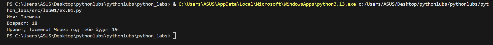
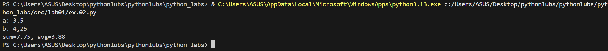
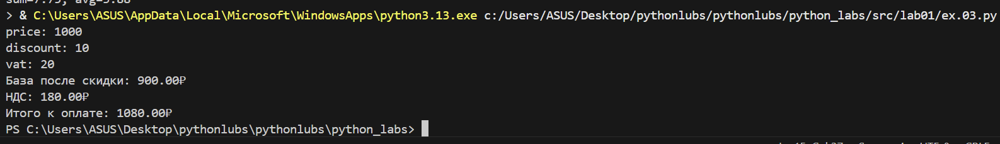
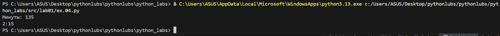
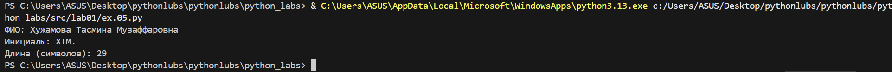

# python_labs
# Лабораторная работа №1
# Ввод/вывод и форматирование в Python

# Цель работы:
Освоить базовые операции ввода-вывода данных, работу с различными типами переменных и форматирование вывода в Python.

# Задание 1: Приветствие и возраст

**Файл:** `src/lab01/ex.01.py`  

**Цель:** Работа со строками и целыми числами, конкатенация строк.

**Ввод:**
- Имя (строка)
- Возраст (целое число)

**Вывод:**


**Пример:**
Имя: Алиса
Возраст: 19
Привет, Алиса! Через год тебе будет 20.# Задание 2: Сумма и среднее арифметическое

# Задание 2: Сумма и среднее

**Файл:** `src/lab01/ex.02.py`  

**Цель:** Работа с вещественными числами, форматирование вывода.

**Ввод:**
- Два вещественных числа (поддерживаются точка и запятая)

**Вывод:**


**Пример:**
a: 3,5
b: 4.25
sum=7.75; avg=3.88#   Задание 3: Расчет чека со скидкой и НДС

# Задание 3 — Чек: скидка и НДС

**Файл:** `src/lab01/ex.03.py`  

**Цель:** Применение математических формул, сложное форматирование вывода.

**Формулы:**
- `base = price * (1 - discount/100)`
- `vat_amount = base * (vat/100)`
- `total = base + vat_amount`

**Ввод:**
- Цена (вещественное)
- Скидка (%) (вещественное)
- НДС (%) (вещественное)

**Вывод:**


**Пример:**
price (₽): 1000
discount (%): 10
vat (%): 20#   Задание 4: Конвертер минут в часы и минуты

# Задание 4 — Минуты → ЧЧ:ММ

**Файл:** `src/lab01/ex.04.py`  

**Цель:** Работа с целочисленным делением, форматирование времени.

**Ввод:**
- Минуты (целое число)

**Вывод:**


**Пример:**
Минуты: 135
2:15

#   Задание 5: Инициалы и длина строки


**Файл:** `src/lab01/ex.05.py`
 
**Цель:** Работа со строками, методами строк, форматирование.

**Ввод:**

 ФИО одной строкой (могут быть лишние пробелы)

**Вывод:**




**Пример:**

ФИО: Хужамова Тасмина Музаффаровна
Инициалы: ХТМ.
Длина (символов): 29

## Задания со звездочкой

### Задание 6*

**Файл:** `src/lab01/ex.06.py`

**Цель:** Обработка ввода данных, работа с булевыми значениями, подсчет элементов.

**Ввод:**
Сначала число N, затем N строк, каждая формата:
Фамилия Имя Возраст Формат_участия

**Вывод:**
Два числа через пробел: количество участников очного формата и количество участников заочного формата.

**Пример:**

**Ввод:**
3

Максимов Максим 18 True

Геннадьев Геннадий 17 False

Алексеев Алексей 17 True

**Вывод:**


**Студент:** Хужамова Тасмина Музаффаровна 
**Группа:** [БИВТ-25-4]  
**Преподаватель:** []


# Лабораторная работа №2
# Коллекции и матрицы (list/tuple/set/dict)
# Цель работы:
Освоить операции над списками, кортежами, множествами и словарями. Научиться работать с 2D-списками (матрицами) — транспонирование, суммы по строкам/столбцам. Аккуратно форматировать текстовые представления записей (на примере студента).

# Задание 1: Операции со списками
**Файл:** `src/lab02/ex.01.py`

``` python
def min_max(nums: list[float | int]) -> tuple[float | int, float | int]:
    """
    Возвращает кортеж (минимум, максимум) из списка чисел.

    Args:
        nums: Список чисел (int или float)

    Returns:
        Кортеж (min, max)

    Raises:
        ValueError: Если список пуст
    """
    if not nums:
        raise ValueError("Список не может быть пустым")

    return min(nums), max(nums)


def unique_sorted(nums: list[float | int]) -> list[float | int]:
    """
    Возвращает отсортированный список уникальных значений.

    Args:
        nums: Список чисел (int или float)

    Returns:
        Отсортированный список уникальных значений
    """
    return sorted(set(nums))


def flatten(mat: list[list | tuple]) -> list:
    """
    "Расплющивает" список списков/кортежей в один список.

    Args:
        mat: Список, содержащий списки или кортежи

    Returns:
        Один список со всеми элементами

    Raises:
        TypeError: Если встретился элемент, не являющийся списком или кортежем

    extend:
    распаковывает элементы списка или кортежа, 
    добавляя в список result отдельные элементы каждого списка
    можно было использовать sublist вот так:
    result = [item for sublist in mat for item in sublist], 
    где часть   for sublist in mat  перебирает вложенные списки/кортежи, 
    а    for item in sublist   извлекает каждый элемент

    isinstance:
    проверяет, что item - спислк или кортеж, если нет, выводит TypError

    """
    result = []
    for item in mat:
        if not isinstance(item, (list, tuple)):
            raise TypeError("Все элементы должны быть списками или кортежами")
        result.extend(item) 
    return result

# Тест 1: нормальный случай
print("min_max([3, -1, 5, 5, 0]):", min_max([3, -1, 5, 5, 0]))

# Тест 2:ValueError
try:
    print("min_max([]):", min_max([]))
except ValueError as e:
    print(f"min_max([]): ValueError - {e}")

# Тест 3: уникальные значения
print("unique_sorted([3, 1, 2, 1, 3]):", unique_sorted([3, 1, 2, 1, 3]))

# Тест 4: нормальное расплющивание
print("flatten([[1, 2], [3, 4]]):", flatten([[1, 2], [3, 4]]))

# Тест 5: TypeError
try:
    print("flatten([1, [3, 4]]):", flatten([1, [3, 4]]))
except TypeError as e:
    print(f"flatten([1, [3, 4]]): TypeError - {e}")
```

**Вывод**


# Задание 2: Операции со списками

**Цель:** Поменять строки и столбцы местами. Пустая матрица [] → [].
Если матрица «рваная» (строки разной длины) — ValueError.

**Файл:** `src/lab02/задание B.2.py`

``` python
def _validate_rectangular(mat: list[list[float | int]]) -> None:
    """
    Проверяет, что матрица прямоугольная (все строки одинаковой длины).

    Args:
        mat: Матрица (список списков)

    Raises:
        ValueError: Если матрица рваная (строки разной длины)
    """
    if not mat:
        return []

    first_len = len(mat[0])
    for i, row in enumerate(mat):
        if len(row) != first_len:
            raise ValueError(f"Матрица рваная: строка {i} имеет длину {len(row)}, ожидалась {first_len}")


def transpose(mat: list[list[float | int]]) -> list[list[float | int]]:
    """
    Транспонирует матрицу (меняет строки и столбцы местами).

    Args:
        mat: Прямоугольная матрица

    Returns:
        Транспонированная матрица

    Raises:
        ValueError: Если матрица рваная
    """
    _validate_rectangular(mat)

    if not mat:
        return []

    return [[mat[i][j] for i in range(len(mat))] for j in range(len(mat[0]))]


def row_sums(mat: list[list[float | int]]) -> list[float]:
    """
    Вычисляет суммы по строкам матрицы.

    Args:
        mat: Прямоугольная матрица

    Returns:
        Список сумм по строкам

    Raises:
        ValueError: Если матрица рваная
    """
    _validate_rectangular(mat)

    return [sum(row) for row in mat]


def col_sums(mat: list[list[float | int]]) -> list[float]:
    """
    Вычисляет суммы по столбцам матрицы.

    Args:
        mat: Прямоугольная матрица

    Returns:
        Список сумм по столбцам

    Raises:
        ValueError: Если матрица рваная
    """
    _validate_rectangular(mat)

    if not mat:
        return []

    return [sum(mat[i][j] for i in range(len(mat))) for j in range(len(mat[0]))]

print("\n=== Matrix Tests ===")

# Тест 1: нормальное транспонирование
print("transpose([[1, 2, 3]]):", transpose([[1, 2, 3]]))  # [[1], [2], [3]]

# Тест 2: транспонирование рваной матрицы
try:
    print("transpose([[1, 2], [3]]):", transpose([[1, 2], [3]]))
except ValueError as e:
    print(f"transpose([[1, 2], [3]]): ValueError - {e}")

# Тест 3: транспонирование пустой матрицы
print("transpose([]):", transpose([]))  # []

# Тест 4: суммы по строкам
print("row_sums([[1, 2, 3], [4, 5, 6]]):", row_sums([[1, 2, 3], [4, 5, 6]]))  # [6, 15]

# Тест 5: суммы по строкам рваной матрицы
try:
    print("row_sums([[1, 2], [3]]):", row_sums([[1, 2], [3]]))
except ValueError as e:
    print(f"row_sums([[1, 2], [3]]): ValueError - {e}")

# Тест 6: суммы по столбцам
print("col_sums([[1, 2, 3], [4, 5, 6]]):", col_sums([[1, 2, 3], [4, 5, 6]]))  # [5, 7, 9]

# Тест 7: суммы по столбцам рваной матрицы
try:
    print("col_sums([[1, 2], [3]]):", col_sums([[1, 2], [3]]))
except ValueError as e:
    print(f"col_sums([[1, 2], [3]]): ValueError - {e}")

# Тест 8: дополнительные тесты
print("transpose([[1, 2], [3, 4]]):", transpose([[1, 2], [3, 4]]))  # [[1, 3], [2, 4]]
print("row_sums([[-1, 1], [10, -10]]):", row_sums([[-1, 1], [10, -10]]))  # [0, 0]
print("col_sums([[-1, 1], [10, -10]]):", col_sums([[-1, 1], [10, -10]]))  # [9, -9]
```
**Вывод:**


#   Задание C: tuples.py

**Файл:** `src/lab02/ex.03.py`

``` python
def format_record(rec: tuple[str, str, float]) -> str:
    """
    Форматирует запись студента в строку.

    Args:
        rec: Кортеж (ФИО, группа, GPA)

    Returns:
        Отформатированная строка вида "Фамилия И.О., гр. ГРУППА, GPA X.XX"

    Raises:
        ValueError: Если ФИО или группа пустые, или GPA отрицательный
        TypeError: Если неверные типы данных
    """
    if not isinstance(rec, tuple) or len(rec) != 3:
        raise TypeError("Запись должна быть кортежем из 3 элементов")

    fio, group, gpa = rec

    if not isinstance(fio, str) or not isinstance(group, str) or not isinstance(gpa, (int, float)):
        raise TypeError("Неверные типы данных: ожидались (str, str, float)")

    # Обработка ФИО
    fio_clean = ' '.join(fio.split()).title()  # Убираем лишние пробелы и делаем заглавные буквы
    fio_parts = fio_clean.split()

    if len(fio_parts) < 2:
        raise ValueError("ФИО должно содержать минимум фамилию и имя")

    if not fio_clean or not group:
        raise ValueError("ФИО и группа не могут быть пустыми")

    if gpa < 0:
        raise ValueError("GPA не может быть отрицательным")

    # Формируем инициалы
    surname = fio_parts[0]
    initials = '.'.join(name[0].upper() for name in fio_parts[1:]) + '.'

    # Форматируем GPA с 2 знаками после запятой
    gpa_formatted = f"{gpa:.2f}"

    return f"{surname} {initials}, гр. {group}, GPA {gpa_formatted}"
'''
print("\n=== Tuples Tests ===")
print(format_record(("Иванов Иван Иванович", "BIVT-25", 4.6)))  # "Иванов И.И., гр. BIVT-25, GPA 4.60"
print(format_record(("Петров Пётр", "IKBO-12", 5.0)))  # "Петров П., гр. IKBO-12, GPA 5.00"
'''
print("\n=== Tuples Tests ===")

# Тест 1: нормальный случай с отчеством
try:
    result = format_record(("Иванов Иван Иванович", "BIVT-25", 4.6))
    print(f"format_record(('Иванов Иван Иванович', 'BIVT-25', 4.6)): {result}")
except Exception as e:
    print(f"format_record(('Иванов Иван Иванович', 'BIVT-25', 4.6)): {type(e).__name__} - {e}")

# Тест 2: нормальный случай без отчества
try:
    result = format_record(("Петров Пётр", "IKBO-12", 5.0))
    print(f"format_record(('Петров Пётр', 'IKBO-12', 5.0)): {result}")
except Exception as e:
    print(f"format_record(('Петров Пётр', 'IKBO-12', 5.0)): {type(e).__name__} - {e}")

# Тест 3: нормальный случай с лишними пробелами
try:
    result = format_record(("    хужамова   тасмина   музаффаровна ", "ABB-01", 3.999))
    print(f"format_record(('  хужамова  тасмина  музаффаровна ', 'ABB-01', 3.999)): {result}")
except Exception as e:
    print(f"format_record(('  хужамова   тасмина   музаффаровна ', 'ABB-01', 3.999)): {type(e).__name__} - {e}")

# Тест 4: ошибка - пустое ФИО
try:
    result = format_record(("", "BIVT-25", 4.6))
    print(f"format_record(('', 'BIVT-25', 4.6)): {result}")
except Exception as e:
    print(f"format_record(('', 'BIVT-25', 4.6)): {type(e).__name__} - {e}")

# Тест 5: ошибка - пустая группа
try:
    result = format_record(("Иванов Иван", "", 4.6))
    print(f"format_record(('Иванов Иван', '', 4.6)): {result}")
except Exception as e:
    print(f"format_record(('Иванов Иван', '', 4.6)): {type(e).__name__} - {e}")

# Тест 6: ошибка - отрицательный GPA
try:
    result = format_record(("Иванов Иван", "BIVT-25", -1.0))
    print(f"format_record(('Иванов Иван', 'BIVT-25', -1.0)): {result}")
except Exception as e:
    print(f"format_record(('Иванов Иван', 'BIVT-25', -1.0)): {type(e).__name__} - {e}")

# Тест 7: ошибка - только фамилия
try:
    result = format_record(("Иванов", "BIVT-25", 4.6))
    print(f"format_record(('Иванов', 'BIVT-25', 4.6)): {result}")
except Exception as e:
    print(f"format_record(('Иванов', 'BIVT-25', 4.6)): {type(e).__name__} - {e}")


# Тест 8: ошибка - неверный тип GPA
try:
    result = format_record(("Иванов Иван", "BIVT-25", "4.6"))
    print(f"format_record(('Иванов Иван', 'BIVT-25', '4.6')): {result}")
except Exception as e:
    print(f"format_record(('Иванов Иван', 'BIVT-25', '4.6')): {type(e).__name__} - {e}")

# Тест 9: нормальный случай с округлением GPA
try:
    result = format_record(("Хужамова Тасмина", "IKBO-10", 3.456))
    print(f"format_record(('Хужамова Тасмина', 'IKBO-10', 3.456)): {result}")
except Exception as e:
    print(f"format_record(('Хужамова Тасмина', 'IKBO-10', 3.456)): {type(e).__name__} - {e}")
```

**Вывод:**


**Студент:** Хужамова Тасмина Музаффаровна
**Группа:** [БИВТ-25-4]  
**Преподаватель:** [Замурагин И.М.]


# Лабораторная работа №3
# Тексты и частоты слов (словарь/множество)
# Цель: 
Нормализовать текст, аккуратно токенизировать, посчитать частоты слов и вывести топ-N.

# Задание A (1.normalaize, 2.tokenize, 3.count_freq, 4.top_n):

**Файл:** `src/lab03/normalaize.py`

```python
def normalize(text: str, *, casefold: bool = True, yo2e: bool = True) -> str:
    """
    Нормализует текст: приводит регистр, заменяет ё на е, убирает лишние пробелы.
    
    Args:
        text: Исходный текст
        casefold: Приводить к нижнему регистру (по умолчанию True)
        yo2e: Заменять ё/Ё на е/Е (по умолчанию True)
        
    Returns:
        Нормализованный текст
    """
    if casefold==True:
        text=text.casefold()

    if yo2e==True:
        text=text.replace("ё","е").replace("Ё","Е")

    for char in ['\t', '\r', '\n']:
        text = text.replace(char, ' ')
        
    text=text.split()
    text=" ".join(text)
    return text

print("=== Тесты текста ===")
texts = [
    "Hello\r\nWorld",
    "ПрИвЕт\nМИр\t", 
    "ёжик, Ёлка",
    "  двойные   пробелы  ",
    "привет, мир! как дела?"
]

for text in texts:
    result = normalize(text)
    print(result)
```

**Вывод:** 


**Файл:** `src/lab03/tokenize.py`

``` python
import re


def tokenize(text: str) -> list[str]:
    """
    Разбивает текст на слова (токены).

    Находит последовательности букв, цифр, подчеркиваний,
    может содержать дефисы внутри слов.

    Args:
        text: Текст для разбиения на слова

    Returns:
        Список найденных слов
    """
    # Регулярное выражение для поиска слов
    # [\w]+    - одна или больше букв/цифр/подчеркиваний
    # (?:-[\w]+)* - ноль или больше повторов: дефис + буквы/цифры
    pattern = r"[\w]+(?:-[\w]+)*"

    # Находим все совпадения с шаблоном
    tokens = re.findall(pattern, text)

    return tokens

print("=== Тесты текста ===")
texts = [
    "привет мир",
    "hello,world!!!", 
    "по-настоящему круто",
    "2025 год",
    "emoji 🐈‍⬛ не слово"
]

for text in texts:
    result = tokenize(text)
    print(result)
```

**Вывод:** 


**Файл:** `src/lab02/задание B.3.py`

``` python


def count_freq(tokens: list[str]) -> dict[str, int]:
    """
    Подсчитывает, сколько раз каждое слово встречается в списке.

    Args:
        tokens: Список слов для подсчета

    Returns:
        Словарь, где ключ - слово, значение - количество вхождений

    Examples:
        >>> count_freq(["яблоко", "банан", "яблоко"])
        {'яблоко': 2, 'банан': 1}

        >>> count_freq(["да", "нет", "да", "может быть"])
        {'да': 2, 'нет': 1, 'может быть': 1}
    """
    # Создаем пустой словарь для результатов
    frequency_dict = {}

    # Проходим по каждому слову в списке
    for word in tokens:
        if word not in frequency_dict:
            # Если слова еще нет - добавляем со счетчиком 1
            frequency_dict[word] = 1
        else:
            # Если слово уже есть - увеличиваем счетчик на 1
            frequency_dict[word] += 1

    return frequency_dict

def top_n(freq: dict[str, int], n: int = 5) -> list[tuple[str, int]]: 
    """Возвращает n наиболее часто встречающихся 
    элементов из словаря частот.

    Args:
        freq: Словарь, где ключи - это элементы (например, слова), 
        а значения - их частота встречаемости

        n: количество самых частовстречающихся элементов, которые нужно вернуть.
        По умолчанию равно 5.

    Returns:
        list[tuple[str, int]]: Список из `n` кортежей, 
        каждый из которых содержит элемент
        (строку) и его частоту (целое число), 
        отсротированные в порядке убывания частоты.
    
    """
    # Преобразуем словарь в список кортежей
    items = list(freq.items())

    # Сортируем по убыванию частоты, при равенстве - по алфавиту.lambda - ключ для сортировки по частотеб 
    sorted_items = sorted(items,  key=lambda x: (-x[1], x[0]))

    # Возвращаем первые n элементов
    return sorted_items[:n]

print("=== Тесты списка/словаря №1===")
tokens = ["a","b","a","c","b","a"]
result_for_count=count_freq(tokens)
result_for_top=top_n(result_for_count, n=2)
print("Словарь частот:", result_for_count)
print("Топ-2 слов:", result_for_top)


print("=== Тесты списка/словаря №2===")
tokens = ["bb","aa","bb","aa","cc"]
result_for_count=count_freq(tokens)
result_for_top=top_n(result_for_count, n=2)
print("Словарь частот:", result_for_count)
print("Топ-2 слов:", result_for_top)

```

**Вывод:**


# Задание test_stats

# Ввод:

``` python
#!/usr/bin/env python3
"""
text_stats.py - скрипт для анализа текстовой статистики
ЛР3 — Тексты и частоты слов
Студент: Хужамова Тасмина Музаффаровна
Группа: БИВТ-25-4
"""

import sys
import os

# Добавляем путь для импорта наших модулей
sys.path.append(os.path.join(os.path.dirname(__file__), '..', 'lib'))

# Импортируем наши функции из библиотеки
from text import normalize, tokenize, count_freq, top_n


def text_stats(text: str, table_mode: bool = False) -> None:
    """
    Анализирует текст и выводит статистику по словам.
    
    Args:
        text: Исходный текст для анализа
        table_mode: Если True, выводит результаты в виде таблицы
    """
    # Проверяем, что текст не пустой
    if not text or not text.strip():
        print("Ошибка: текст пустой или содержит только пробелы")
        return
    
    # 1. Нормализуем текст (приводим к нижнему регистру, убираем лишние пробелы)
    norm_text = normalize(text)
    
    # 2. Разбиваем на отдельные слова (токены)
    tokens = tokenize(norm_text)
    
    # 3. Подсчитываем частоту каждого слова
    freq = count_freq(tokens)
    
    # 4. Получаем статистику
    total_words = len(tokens)
    unique_words = len(freq)
    top_words = top_n(freq, n=5)
    
    # 5. Выводим результаты
    print(f'Всего слов: {total_words}')
    print(f'Уникальных слов: {unique_words}')
    print('Топ-5:')
    
    if table_mode:
        print_table_output(top_words)
    else:
        print_simple_output(top_words)


def print_simple_output(top_words):
    """
    Простой вывод топ-слов в формате 'слово:частота'
    
    Args:
        top_words: Список кортежей (слово, частота)
    """
    for word, count in top_words:
        print(f'{word}:{count}')


def print_table_output(top_words):
    """
    Красиво выровненный табличный вывод
    
    Args:
        top_words: Список кортежей (слово, частота)
    """
    if not top_words:
        print("Нет данных для отображения")
        return
    
    # Находим максимальную длину слова для красивого выравнивания
    max_word_len = max(len(word) for word, _ in top_words)
    
    # Заголовок таблицы
    header = "слово".ljust(max_word_len) + " | частота"
    separator = "-" * len(header)
    
    print(header)
    print(separator)
    
    # Выводим данные таблицы
    for word, count in top_words:
        print(f"{word.ljust(max_word_len)} | {count}")


def get_input_text():
    """
    Получает текст от пользователя разными способами
    
    Returns:
        Введенный текст
    """
    # Проверяем, есть ли данные в stdin (pipe или перенаправление)
    if not sys.stdin.isatty():  # Если данные приходят через pipe или перенаправление
        return sys.stdin.read().strip()
    
    # Проверяем, есть ли аргументы командной строки
    if len(sys.argv) > 1 and not sys.argv[1].startswith('--'):
        # Читаем из файла: python text_stats.py filename.txt
        try:
            with open(sys.argv[1], 'r', encoding='utf-8') as f:
                return f.read()
        except FileNotFoundError:
            print(f"Ошибка: файл {sys.argv[1]} не найден")
            return None
    else:
        # Интерактивный ввод
        print("Введите текст для анализа (можно несколько строк):")
        print("Для завершения ввода нажмите Ctrl+D (Linux/Mac) или Ctrl+Z (Windows):")
        
        try:
            return sys.stdin.read().strip()
        except EOFError:
            print("\nВвод завершен.")
            return None


def main():
    """
    Основная функция - получает текст и запускает анализ
    """
    # Проверяем, включен ли табличный режим
    table_mode = '--table' in sys.argv or os.getenv('TEXT_STATS_TABLE', '0') == '1'
    
    # Получаем текст
    text = get_input_text()
    
    if not text:
        print("Ошибка: текст не может быть пустым")
        return
    
    # Запускаем анализ
    text_stats(text, table_mode)


if __name__ == '__main__':
    main()
```

# Вывод


# Лабораторная работа №4
# задание А

**Файл text_report:**
``` python
#!/usr/bin/env python3
"""
text_report.py - скрипт для генерации отчетов по текстовой статистике
ЛР4 — Файлы: TXT/CSV и отчёты

Этот скрипт анализирует текстовые файлы: подсчитывает сколько раз каждое слово встречается,
и сохраняет результаты в CSV файл. Также показывает статистику в консоли.

Пример использования:
    python src/lab04/text_report.py                    # Базовая версия
    python src/lab04/text_report.py --table            # С красивой таблицей
    python src/lab04/text_report.py --input my.txt     # Свои файлы
"""

# Импортируем стандартные модули Python
import sys        # Для работы с системными функциями (выход из программы)
import argparse   # Для обработки аргументов командной строки (--input, --output и т.д.)
from pathlib import Path  # Для удобной работы с путями файлов и папок

"""
ВНИМАНИЕ: следующий блок кода нужен чтобы Python мог найти наши собственные модули
в папке src/lib/ и src/lab04/
"""
# Получаем путь к родительской папке (src/) и добавляем его в sys.path
# Это нужно чтобы импортировать наши собственные модули
sys.path.append(str(Path(__file__).parent.parent))

# Импортируем наши собственные функции из других файлов
from lib.text import normalize, tokenize, count_freq, top_n        # Функции из ЛР3 для работы с текстом
from lab04.io_txt_csv import read_text, write_csv                 # Функции из этой ЛР для работы с файлами


def print_table_output(top_words: list[tuple[str, int]]) -> None:
    """
    Выводит красивую таблицу с результатами в консоль.
    
    Эта функция берет список слов с частотами и выводит их в виде аккуратной таблицы
    с выровненными колонками.
    
    Args:
        top_words (list[tuple[str, int]]): Список кортежей в формате (слово, частота)
            Пример: [('привет', 2), ('мир', 1), ('текст', 1)]
    
    Returns:
        None: Функция только печатает в консоль, ничего не возвращает
    
    Пример вывода:
        слово      | частота
        -------------------
        привет     | 2
        мир        | 1
        текст      | 1
    """
    # Проверяем, есть ли данные для вывода
    if not top_words:
        print("Нет данных для отображения")
        return
    
    """
    Шаг 1: Находим самую длинную строку среди всех слов
    Это нужно чтобы сделать красивую таблицу с ровными колонками
    """
    # Проходим по всем словам и находим максимальную длину
    max_word_len = max(len(word) for word, _ in top_words)
    
    """
    Шаг 2: Создаем заголовок таблицы
    ljust() добавляет пробелы справа до нужной длины, чтобы выровнять текст
    """
    header = "слово".ljust(max_word_len) + " | частота"
    
    # Создаем разделительную линию под заголовком
    separator = "-" * len(header)  # Строка из символов '-' той же длины что и заголовок
    
    """
    Шаг 3: Выводим таблицу
    """
    print(header)      # Заголовок: "слово      | частота"
    print(separator)   # Разделитель: "-------------------"
    
    # Выводим каждую строку данных
    for word, count in top_words:
        # ljust() выравнивает слово по левому краю, добавляя пробелы справа
        print(f"{word.ljust(max_word_len)} | {count}")


def analyze_text(text: str) -> tuple[int, int, list[tuple[str, int]]]:
    """
    Анализирует текст и возвращает статистику по словам.
    
    Эта функция является "сердцем" программы - она принимает текст и возвращает
    всю необходимую статистику: общее количество слов, количество уникальных слов,
    и список самых частых слов.
    
    Args:
        text (str): Исходный текст для анализа
        
    Returns:
        tuple: Кортеж из трех элементов:
            - total_words (int): Общее количество слов в тексте
            - unique_words (int): Количество уникальных слов (без повторений)
            - top_words (list): Список кортежей (слово, частота) для топ-5 слов
    
    Процесс анализа:
        1. Нормализация: приводим текст к нижнему регистру, убираем лишние пробелы
        2. Токенизация: разбиваем текст на отдельные слова
        3. Подсчет частот: считаем сколько раз каждое слово встречается
        4. Сортировка: находим 5 самых частых слов
    """
    # Шаг 1: Нормализуем текст (приводим к нижнему регистру, убираем лишние пробелы)
    normalized_text = normalize(text)
    
    # Шаг 2: Разбиваем нормализованный текст на отдельные слова (токены)
    tokens = tokenize(normalized_text)
    
    # Шаг 3: Подсчитываем частоту каждого слова (сколько раз встречается)
    frequency_dict = count_freq(tokens)
    
    # Шаг 4: Находим 5 самых частых слов
    top_5_words = top_n(frequency_dict, 5)
    
    # Возвращаем результаты
    total_word_count = len(tokens)           # Всего слов (с повторениями)
    unique_word_count = len(frequency_dict)  # Уникальных слов (без повторений)
    
    return total_word_count, unique_word_count, top_5_words


def generate_report(input_file: str, output_file: str, encoding: str = "utf-8", table_output: bool = False) -> None:
    """
    Основная функция генерации отчета - координирует всю работу.
    
    Эта функция:
      1. Читает текст из файла
      2. Анализирует его
      3. Сохраняет полные результаты в CSV
      4. Выводит краткую статистику в консоль
    
    Args:
        input_file (str): Путь к файлу с текстом для анализа
        output_file (str): Путь куда сохранить CSV отчет
        encoding (str): Кодировка входного файла (utf-8, cp1251 и т.д.)
        table_output (bool): Если True - выводит красивую таблицу, иначе простой список
    
    Raises:
        FileNotFoundError: Если входной файл не существует
        UnicodeDecodeError: Если неправильно указана кодировка файла
    """
    try:
        """
        БЛОК 1: ЧТЕНИЕ ФАЙЛА
        """
        print(f"Читаем файл: {input_file}")
        text_content = read_text(input_file, encoding)
        
        # Проверяем что файл не пустой
        if not text_content.strip():
            print("Внимание: файл пустой или содержит только пробелы")
        
        """
        БЛОК 2: АНАЛИЗ ТЕКСТА
        """
        print("Анализируем текст...")
        total_words, unique_words, top_words = analyze_text(text_content)
        
        """
        БЛОК 3: ПОДГОТОВКА ДАННЫХ ДЛЯ CSV
        Здесь мы заново получаем частоты всех слов и сортируем их
        для сохранения в CSV файл
        """
        # Получаем частоты всех слов (не только топ-5)
        all_frequencies = count_freq(tokenize(normalize(text_content)))
        
        # Сортируем слова по убыванию частоты, при равенстве - по алфавиту
        sorted_all_words = sorted(all_frequencies.items(), key=lambda x: (-x[1], x[0]))
        
        # Преобразуем в формат для CSV: список кортежей (слово, количество)
        csv_data = [(word, count) for word, count in sorted_all_words]
        
        """
        БЛОК 4: СОХРАНЕНИЕ CSV ОТЧЕТА
        """
        print(f"Сохраняем отчет...")
        write_csv(csv_data, output_file, header=("word", "count"))
        
        """
        БЛОК 5: ВЫВОД СТАТИСТИКИ В КОНСОЛЬ
        """
        print("\nРЕЗУЛЬТАТЫ АНАЛИЗА:")
        print(f"   Всего слов: {total_words}")
        print(f"   Уникальных слов: {unique_words}")
        print("   Топ-5 самых частых слов:")
        
        if table_output:
            # ВЫВОД В ВИДЕ КРАСИВОЙ ТАБЛИЦЫ
            print_table_output(top_words)
        else:
            # ПРОСТОЙ ВЫВОД (как было раньше)
            for word, count in top_words:
                print(f"   {word}: {count}")
            
        print(f"\nПолный отчет сохранен в: {output_file}")
        
    except FileNotFoundError:
        # Обработка ошибки: файл не найден
        print(f"Ошибка: файл '{input_file}' не найден!")
        print("   Проверьте путь к файлу и его наличие")
        sys.exit(1)  # Завершаем программу с кодом ошибки 1
        
    except UnicodeDecodeError:
        # Обработка ошибки: неправильная кодировка
        print(f"Ошибка: не удалось прочитать файл '{input_file}' в кодировке '{encoding}'")
        print("   Возможные решения:")
        print("   - Укажите правильную кодировку: --encoding cp1251")
        print("   - Преобразуйте файл в UTF-8")
        sys.exit(1)  # Завершаем программу с кодом ошибки 1


def main() -> None:
    """
    Главная функция программы - точка входа.
    
    Эта функция:
      1. Настраивает парсер аргументов командной строки
      2. Читает аргументы которые ввел пользователь
      3. Запускает процесс генерации отчета
    
    Аргументы командной строки:
      --input, -i    : Путь к входному файлу
      --output, -o   : Путь для сохранения отчета  
      --encoding, -e : Кодировка файла
      --table, -t    : Включить красивый табличный вывод
    """
    """
    Шаг 1: СОЗДАЕМ ПАРСЕР АРГУМЕНТОВ
    ArgumentParser - это "умный" обработчик который сам генерирует справку
    и проверяет правильность аргументов
    """
    parser = argparse.ArgumentParser(
        description="Анализирует текстовый файл и генерирует отчет о частоте слов",
        epilog="Примеры использования:\n"
               "  python text_report.py                    # Базовая версия\n"
               "  python text_report.py --table            # С красивой таблицей\n"
               "  python text_report.py -i story.txt -t    # Анализ story.txt с таблицей"
    )
    
    """
    Шаг 2: ДОБАВЛЯЕМ АРГУМЕНТЫ
    Каждый add_argument добавляет один параметр который можно указать в командной строке
    """
    
    # Аргумент для входного файла
    parser.add_argument(
        '--input',                   # Длинное имя: --input
        '-i',                        # Короткое имя: -i
        default='data/lab04/input.txt',  # Значение по умолчанию если аргумент не указан
        help='Путь к файлу с текстом для анализа'  # Описание для справки
    )
    
    # Аргумент для выходного файла
    parser.add_argument(
        '--output', 
        '-o',
        default='data/lab04/report.csv',
        help='Путь для сохранения CSV отчета с полной статистикой'
    )
    
    # Аргумент для кодировки файла
    parser.add_argument(
        '--encoding',
        '-e', 
        default='utf-8',
        help='Кодировка входного файла (utf-8, cp1251, koi8-r и т.д.)'
    )
    
    # Аргумент для табличного вывода (флаг - либо есть, либо нет)
    parser.add_argument(
        '--table',
        '-t',
        action='store_true',  # Особый тип аргумента - флаг (True если указан, False если нет)
        help='Выводить топ-5 слов в виде красивой таблицы'
    )
    
    """
    Шаг 3: ЧИТАЕМ АРГУМЕНТЫ ИЗ КОМАНДНОЙ СТРОКИ
    parse_args() анализирует sys.argv (аргументы которые передали при запуске)
    и возвращает объект с значениями всех аргументов
    """
    args = parser.parse_args()
    
    """
    Шаг 4: ЗАПУСКАЕМ ГЕНЕРАЦИЮ ОТЧЕТА
    Передаем все аргументы в основную функцию
    """
    print("Запуск анализа текста...")
    print(f"   Входной файл: {args.input}")
    print(f"   Выходной файл: {args.output}") 
    print(f"   Кодировка: {args.encoding}")
    print(f"   Табличный вывод: {'ВКЛЮЧЕН' if args.table else 'выключен'}")
    print()
    
    generate_report(args.input, args.output, args.encoding, args.table)


"""
ЭТА СТРОКА ОЧЕНЬ ВАЖНА!
Она означает: "запускать функцию main() только если этот файл запущен напрямую,
а не импортирован как модуль в другой программе"

Это стандартная практика в Python - она позволяет использовать файл и как скрипт,
и как модуль который можно импортировать в других программах
"""
if __name__ == "__main__":
    main()
```

**Файл io_txt_csv:**
``` python
"""
Модуль для работы с текстовыми и CSV файлами.
ЛР4 — Файлы: TXT/CSV и отчёты
"""

import csv
from pathlib import Path
from typing import Union, Iterable, Sequence


def read_text(path: Union[str, Path], encoding: str = "utf-8") -> str:
    """
    Читает текстовый файл и возвращает его содержимое как строку.
    
    Args:
        path: Путь к файлу (строка или Path объект)
        encoding: Кодировка файла (по умолчанию UTF-8)
        
    Returns:
        Содержимое файла как строка
        
    Raises:
        FileNotFoundError: Если файл не существует
        UnicodeDecodeError: Если неправильная кодировка
        
    Examples:
        >>> text = read_text("data/input.txt")
        >>> text = read_text("data/file.txt", encoding="cp1251")
    """
    # Преобразуем в Path объект для удобства
    file_path = Path(path)
    
    # Читаем файл с указанной кодировкой
    # Если файла нет - выбросится FileNotFoundError
    # Если кодировка неправильная - UnicodeDecodeError
    return file_path.read_text(encoding=encoding)


def write_csv(rows: Iterable[Sequence], path: Union[str, Path], 
              header: tuple[str, ...] = None) -> None:
    """
    Записывает данные в CSV файл.
    
    Args:
        rows: Итерируемый объект со строками данных
        path: Путь для сохранения CSV файла
        header: Заголовок таблицы (опционально)
        
    Raises:
        ValueError: Если строки имеют разную длину
        
    Examples:
        >>> data = [("word", "count"), ("привет", 2)]
        >>> write_csv(data, "report.csv", header=("word", "count"))
    """
    file_path = Path(path)
    rows_list = list(rows)  # Преобразуем в список для проверки
    
    # Проверяем, что все строки одинаковой длины
    if rows_list:
        first_len = len(rows_list[0])
        for i, row in enumerate(rows_list):
            if len(row) != first_len:
                raise ValueError(f"Строка {i} имеет длину {len(row)}, ожидалась {first_len}")
    
    # Создаем родительские папки если их нет
    file_path.parent.mkdir(parents=True, exist_ok=True)
    
    # Записываем в CSV
    with file_path.open('w', encoding='utf-8', newline='') as file:
        writer = csv.writer(file)
        
        # Записываем заголовок если есть
        if header is not None:
            writer.writerow(header)
        
        # Записываем данные
        for row in rows_list:
            writer.writerow(row)


def ensure_parent_dir(path: Union[str, Path]) -> None:
    """
    Создает родительские директории если их нет.
    
    Args:
        path: Путь к файлу или директории
        
    Examples:
        >>> ensure_parent_dir("data/reports/final.csv")
        # Создаст папки data/ и data/reports/ если их нет
    """
    file_path = Path(path)
    file_path.parent.mkdir(parents=True, exist_ok=True)
```

# Тесты и выводы

**Обычный вывод**


**Табличный вывод**


**Вывод для файла а**


**Вывод для файла b**


**Тест ошибок**


**Вывод справки - help**


# Лабораторная работа №5
# JSON и конвертации (JSON↔CSV, CSV→XLSX): Техническое задание
**Цель:**
Разобраться с форматом JSON, сериализацией/десериализацией и табличными конвертациями

**Файл:** json_csv.py

``` python
"""
Модуль для конвертации между JSON и CSV форматами.
ЛР5 — JSON и конвертации
"""

import json
import csv
from pathlib import Path


def json_to_csv(json_path: str, csv_path: str) -> None:
    """
    Конвертирует JSON файл в CSV формат.
    
    Поддерживает JSON файлы содержащие список словарей.
    Например: [{"name": "Alice", "age": 25}, {"name": "Bob", "age": 30}]
    
    Args:
        json_path: Путь к исходному JSON файлу
        csv_path: Путь для сохранения CSV файла
        
    Raises:
        FileNotFoundError: Если JSON файл не существует
        ValueError: Если JSON пустой, не список или содержит не словари
    """
    # Преобразуем пути в Path объекты
    json_file = Path(json_path)
    csv_file = Path(csv_path)
    
    # Проверяем существование JSON файла
    if not json_file.exists():
        raise FileNotFoundError(f"JSON файл не найден: {json_path}")
    
    # Читаем JSON файл
    with json_file.open('r', encoding='utf-8') as jf:
        try:
            data = json.load(jf)
        except json.JSONDecodeError as e:
            raise ValueError(f"Ошибка чтения JSON: {e}")
    
    # Валидация данных
    if not data:
        raise ValueError("Пустой JSON файл")
    
    if not isinstance(data, list):
        raise ValueError("JSON должен содержать список")
    
    if not all(isinstance(item, dict) for item in data):
        raise ValueError("Все элементы JSON должны быть словарями")
    
    # Создаем родительские папки если их нет
    csv_file.parent.mkdir(parents=True, exist_ok=True)
    
    # Получаем все уникальные ключи из всех словарей
    all_keys = set()
    for item in data:
        all_keys.update(item.keys())
    
    # Сортируем ключи по алфавиту для единообразия
    fieldnames = sorted(all_keys)
    
    # Записываем CSV
    with csv_file.open('w', encoding='utf-8', newline='') as cf:
        writer = csv.DictWriter(cf, fieldnames=fieldnames)
        writer.writeheader()
        
        for item in data:
            # Заполняем отсутствующие поля пустыми строками
            row = {key: item.get(key, '') for key in fieldnames}
            writer.writerow(row)


def csv_to_json(csv_path: str, json_path: str) -> None:
    """
    Конвертирует CSV файл в JSON формат.
    
    Преобразует CSV в список словарей, где первая строка - заголовки.
    
    Args:
        csv_path: Путь к исходному CSV файлу
        json_path: Путь для сохранения JSON файла
        
    Raises:
        FileNotFoundError: Если CSV файл не существует
        ValueError: Если CSV файл пустой или не имеет заголовка
    """
    # Преобразуем пути в Path объекты
    csv_file = Path(csv_path)
    json_file = Path(json_path)
    
    # Проверяем существование CSV файла
    if not csv_file.exists():
        raise FileNotFoundError(f"CSV файл не найден: {csv_path}")
    
    # Читаем CSV файл
    with csv_file.open('r', encoding='utf-8') as cf:
        reader = csv.DictReader(cf)
        
        # Преобразуем в список
        data = list(reader)
    
    # Валидация данных
    if not data:
        raise ValueError("CSV файл пустой или не содержит данных")
    
    # Создаем родительские папки если их нет
    json_file.parent.mkdir(parents=True, exist_ok=True)
    
    # Записываем JSON
    with json_file.open('w', encoding='utf-8') as jf:
        json.dump(data, jf, ensure_ascii=False, indent=2)

```
**Вывод:**


**Вывод:**


**Файл:** csv_xlsx.py

``` python
"""
Модуль для конвертации CSV в XLSX формат.
ЛР5 — JSON и конвертации
"""

import csv
from pathlib import Path

# Импортируем openpyxl (внешняя библиотека)
try:
    from openpyxl import Workbook
    from openpyxl.utils import get_column_letter
except ImportError:
    raise ImportError("Для работы этого модуля установите openpyxl: pip install openpyxl")


def csv_to_xlsx(csv_path: str, xlsx_path: str) -> None:
    """
    Конвертирует CSV файл в XLSX формат (Excel).
    
    Автоматически подбирает ширину колонок по содержимому.
    
    Args:
        csv_path: Путь к исходному CSV файлу
        xlsx_path: Путь для сохранения XLSX файла
        
    Raises:
        FileNotFoundError: Если CSV файл не существует
        ValueError: Если CSV файл пустой
    """
    # Преобразуем пути в Path объекты
    csv_file = Path(csv_path)
    xlsx_file = Path(xlsx_path)
    
    # Проверяем существование CSV файла
    if not csv_file.exists():
        raise FileNotFoundError(f"CSV файл не найден: {csv_path}")
    
    # Читаем CSV файл
    with csv_file.open('r', encoding='utf-8') as cf:
        reader = csv.reader(cf)
        rows = list(reader)
    
    # Валидация данных
    if not rows:
        raise ValueError("CSV файл пустой")
    
    # Создаем родительские папки если их нет
    xlsx_file.parent.mkdir(parents=True, exist_ok=True)
    
    # Создаем новую книгу Excel
    workbook = Workbook()
    sheet = workbook.active
    sheet.title = "Sheet1"
    
    # Записываем данные из CSV в Excel
    for row in rows:
        sheet.append(row)
    
    # Настраиваем авто-ширину колонок
    for column_cells in sheet.columns:
        # Получаем максимальную длину текста в колонке
        max_length = 0
        column_letter = get_column_letter(column_cells[0].column)
        
        for cell in column_cells:
            try:
                # Проверяем длину текста в ячейке
                if len(str(cell.value)) > max_length:
                    max_length = len(str(cell.value))
            except:
                pass
        
        # Устанавливаем ширину колонки (минимум 8 символов)
        adjusted_width = max(max_length + 2, 8)
        sheet.column_dimensions[column_letter].width = adjusted_width
    
    # Сохраняем XLSX файл
    workbook.save(xlsx_file)

```
**Вывод:**


**Расположение файлов и папок в системе:**


# Лабораторная работа №6
# cli_convert:
``` python
# src/lab06/cli_convert.py
import argparse
import sys
from pathlib import Path

def main():
    parser = argparse.ArgumentParser(
        description="Конвертер данных между форматами JSON, CSV, XLSX"
    )
    subparsers = parser.add_subparsers(dest="command", help="Доступные команды")
    
    # json2csv команда
    json2csv_parser = subparsers.add_parser("json2csv", help="Конвертировать JSON в CSV")
    json2csv_parser.add_argument("--in", dest="input", required=True, help="Входной JSON файл")
    json2csv_parser.add_argument("--out", dest="output", required=True, help="Выходной CSV файл")
    
    # csv2json команда  
    csv2json_parser = subparsers.add_parser("csv2json", help="Конвертировать CSV в JSON")
    csv2json_parser.add_argument("--in", dest="input", required=True, help="Входной CSV файл")
    csv2json_parser.add_argument("--out", dest="output", required=True, help="Выходной JSON файл")
    
    # csv2xlsx команда
    csv2xlsx_parser = subparsers.add_parser("csv2xlsx", help="Конвертировать CSV в XLSX")
    csv2xlsx_parser.add_argument("--in", dest="input", required=True, help="Входной CSV файл")
    csv2xlsx_parser.add_argument("--out", dest="output", required=True, help="Выходной XLSX файл")
    
    args = parser.parse_args()
    
    if not args.command:
        parser.print_help()
        return
    
    try:
        if args.command == "json2csv":
            from src.lab05.json_csv import json_to_csv
            json_to_csv(args.input, args.output)
            print(f"✅ Успешно конвертирован {args.input} → {args.output}")
            
        elif args.command == "csv2json":
            from src.lab05.json_csv import csv_to_json
            csv_to_json(args.input, args.output)
            print(f"✅ Успешно конвертирован {args.input} → {args.output}")
            
        elif args.command == "csv2xlsx":
            from src.lab05.csv_xlsx import csv_to_xlsx
            csv_to_xlsx(args.input, args.output)
            print(f"✅ Успешно конвертирован {args.input} → {args.output}")
            
    except FileNotFoundError as e:
        print(f"❌ Ошибка: файл не найден - {e}")
        sys.exit(1)
    except Exception as e:
        print(f"❌ Ошибка при конвертации: {e}")
        sys.exit(1)

if __name__ == "__main__":
    main()
    
```


# cli_text:
``` python
# src/lab06/cli_text.py
import argparse
import sys
from pathlib import Path

def read_and_tokenize(filepath: str):
    """
    Читает файл и разбивает на слова (токены).
    """
    with open(filepath, 'r', encoding='utf-8') as f:
        text = f.read()
    
    # Приводим к нижнему регистру и разбиваем на слова
    text = text.lower()
    # Убираем пунктуацию и разбиваем на слова
    import string
    for char in string.punctuation:
        text = text.replace(char, ' ')
    
    tokens = text.split()
    return tokens

def main():
    parser = argparse.ArgumentParser(
        description="Текстовые утилиты для анализа файлов"
    )
    subparsers = parser.add_subparsers(dest="command", help="Доступные команды")
    
    # cat команда
    cat_parser = subparsers.add_parser("cat", help="Вывести содержимое файла")
    cat_parser.add_argument("--input", required=True, help="Входной файл")
    cat_parser.add_argument("-n", action="store_true", help="Нумеровать строки")
    
    # stats команда
    stats_parser = subparsers.add_parser("stats", help="Статистика частот слов")
    stats_parser.add_argument("--input", required=True, help="Входной текстовый файл")
    stats_parser.add_argument("--top", type=int, default=5, help="Количество топ-слов")
    
    args = parser.parse_args()
    
    if not args.command:
        parser.print_help()
        return
    
    try:
        if args.command == "cat":
            with open(args.input, 'r', encoding='utf-8') as f:
                for i, line in enumerate(f, 1):
                    if args.n:
                        print(f"{i:4} {line}", end='')
                    else:
                        print(line, end='')
                        
        elif args.command == "stats":
            # Импортируем функции из lab03
            from src.lab03.text_stats import count_freq, top_n
            
            # Читаем файл и получаем токены
            tokens = read_and_tokenize(args.input)
            
            # Подсчитываем частоту
            frequency = count_freq(tokens)
            
            # Получаем топ-N слов
            top_words = top_n(frequency, args.top)
            
            print(f"Топ-{args.top} слов в файле {args.input}:")
            for word, count in top_words:
                print(f"  {word}: {count}")
                
    except FileNotFoundError:
        print(f"❌ Ошибка: файл {args.input} не найден")
        sys.exit(1)
    except Exception as e:
        print(f"❌ Ошибка: {e}")
        sys.exit(1)

if __name__ == "__main__":
    main()
```

# Тесты и выводы:

**Вывод cli_csv2json:**


**Вывод cli_csv2xlsx:**


**Вывод cli_json2csv:**


**Вывод cli_text_help:**


**Вывод cli_convert_help:**


**Вывод text_cat:**


**Вывод top_3, 5:**


# Лабораторная работа №7

# test_json_csv.py:
``` python
import pytest
import json
import csv
import sys
import os

# Добавляем корневую папку в путь Python
sys.path.insert(0, os.path.abspath("."))

from src.lab05.json_csv import json_to_csv, csv_to_json


def test_json_to_csv_basic(tmp_path):
    """Тест базовой конвертации JSON → CSV"""
    # Создаём тестовый JSON файл
    json_path = tmp_path / "test.json"
    csv_path = tmp_path / "test.csv"

    test_data = [
        {"name": "Анна", "age": 25, "city": "Москва"},
        {"name": "Петр", "age": 30, "city": "СПб"},
        {"name": "Мария", "age": 28, "city": "Казань"},
    ]

    # Записываем JSON
    json_path.write_text(
        json.dumps(test_data, ensure_ascii=False, indent=2), encoding="utf-8"
    )

    # Конвертируем
    json_to_csv(str(json_path), str(csv_path))

    # Проверяем результат
    assert csv_path.exists()

    with open(csv_path, "r", encoding="utf-8") as f:
        reader = csv.DictReader(f)
        rows = list(reader)

    assert len(rows) == 3
    assert set(rows[0].keys()) == {"name", "age", "city"}
    assert rows[0]["name"] == "Анна"
    assert rows[0]["age"] == "25"
    assert rows[0]["city"] == "Москва"


def test_csv_to_json_basic(tmp_path):
    """Тест базовой конвертации CSV → JSON"""
    # Создаём тестовый CSV файл
    csv_path = tmp_path / "test.csv"
    json_path = tmp_path / "test.json"

    csv_content = """name,age,city
Анна,25,Москва
Петр,30,СПб
Мария,28,Казань"""

    csv_path.write_text(csv_content, encoding="utf-8")

    # Конвертируем
    csv_to_json(str(csv_path), str(json_path))

    # Проверяем результат
    assert json_path.exists()

    with open(json_path, "r", encoding="utf-8") as f:
        data = json.load(f)

    assert len(data) == 3
    assert data[0] == {"name": "Анна", "age": "25", "city": "Москва"}
    assert data[1] == {"name": "Петр", "age": "30", "city": "СПб"}


def test_json_to_csv_empty_list(tmp_path):
    """Тест пустого JSON списка"""
    json_path = tmp_path / "empty.json"
    csv_path = tmp_path / "empty.csv"

    json_path.write_text("[]", encoding="utf-8")

    # Должна быть ошибка
    with pytest.raises(ValueError, match=".*Пустой.*|.*empty.*"):
        json_to_csv(str(json_path), str(csv_path))


def test_json_to_csv_invalid_json(tmp_path):
    """Тест некорректного JSON"""
    json_path = tmp_path / "invalid.json"
    csv_path = tmp_path / "test.csv"

    json_path.write_text("{not valid json}", encoding="utf-8")

    with pytest.raises(ValueError, match=".*JSON.*"):
        json_to_csv(str(json_path), str(csv_path))


def test_csv_to_json_missing_file():
    """Тест отсутствующего файла"""
    with pytest.raises(FileNotFoundError):
        csv_to_json("несуществующий_файл.csv", "output.json")


def test_json_to_csv_missing_file():
    """Тест отсутствующего файла"""
    with pytest.raises(FileNotFoundError):
        json_to_csv("несуществующий_файл.json", "output.csv")


def test_json_to_csv_roundtrip(tmp_path):
    """Тест полного цикла JSON → CSV → JSON"""
    # Исходные данные
    original_data = [{"name": "Test", "value": 123}, {"name": "Another", "value": 456}]

    # JSON → CSV
    json_path = tmp_path / "original.json"
    csv_path = tmp_path / "converted.csv"
    json_path2 = tmp_path / "back.json"

    json_path.write_text(json.dumps(original_data), encoding="utf-8")
    json_to_csv(str(json_path), str(csv_path))

    # CSV → JSON
    csv_to_json(str(csv_path), str(json_path2))

    # Проверяем что данные совпадают
    with open(json_path2, "r", encoding="utf-8") as f:
        restored_data = json.load(f)

    # В CSV все значения строковые, поэтому сравниваем соответствующим образом
    assert len(restored_data) == len(original_data)
    assert restored_data[0]["name"] == original_data[0]["name"]
    assert restored_data[0]["value"] == str(
        original_data[0]["value"]
    )  # CSV хранит строки

```

# test_text.py:

``` python
import sys
import os

# Добавляем корневую папку в путь Python
sys.path.insert(0, os.path.abspath("."))

from src.lab03.text_stats import count_freq, top_n


def test_count_freq_basic():
    """Тест базовой функции подсчёта частот"""
    tokens = ["apple", "banana", "apple", "cherry", "banana", "apple"]
    result = count_freq(tokens)

    assert result == {"apple": 3, "banana": 2, "cherry": 1}
    assert len(result) == 3
    assert result["apple"] == 3
    assert result["banana"] == 2
    assert result["cherry"] == 1


def test_count_freq_empty():
    """Тест пустого списка"""
    tokens = []
    result = count_freq(tokens)
    assert result == {}


def test_count_freq_single_word():
    """Тест одного слова"""
    tokens = ["hello"] * 5
    result = count_freq(tokens)
    assert result == {"hello": 5}


def test_top_n_basic():
    """Тест функции top_n"""
    freq = {"a": 5, "b": 3, "c": 10, "d": 1, "e": 7}
    result = top_n(freq, 3)

    assert result == [("c", 10), ("e", 7), ("a", 5)]
    assert len(result) == 3


def test_top_n_all():
    """Тест когда запрашиваем все элементы"""
    freq = {"a": 1, "b": 2, "c": 3}
    result = top_n(freq, 10)  # больше чем есть
    assert result == [("c", 3), ("b", 2), ("a", 1)]


def test_top_n_tie_breaker():
    """Тест при равенстве частот (сортировка по алфавиту)"""
    freq = {"z": 5, "a": 5, "m": 5, "b": 2}
    result = top_n(freq, 3)
    # При равенстве частот сортировка по алфавиту
    assert result == [("a", 5), ("m", 5), ("z", 5)]


def test_top_n_zero_n():
    """Тест когда n=0"""
    freq = {"a": 1, "b": 2}
    result = top_n(freq, 0)
    assert result == []


def test_top_n_default():
    """Тест с default значением n=5"""
    freq = {"a": 1, "b": 2, "c": 3, "d": 4, "e": 5, "f": 6}
    result = top_n(freq)  # default n=5
    assert len(result) == 5
    assert result[0] == ("f", 6)

```

# Тесты и выводы:

**Выводы тестов:**


**Вывод автоформаттера black+black check:**


**Выводы pyptoject.toml:**

