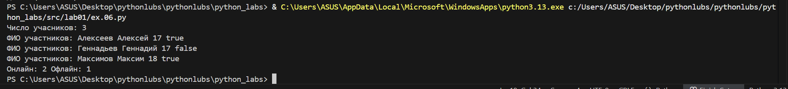
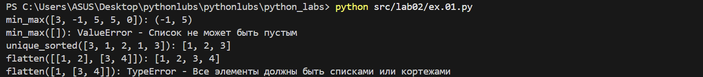
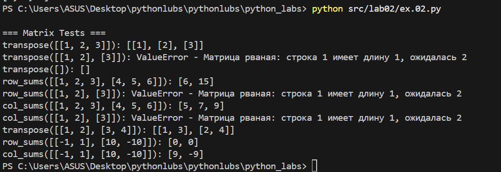

# python_labs
# Лабораторная работа №1
# Ввод/вывод и форматирование в Python

# Цель работы:
Освоить базовые операции ввода-вывода данных, работу с различными типами переменных и форматирование вывода в Python.

# Задание 1: Приветствие и возраст

**Файл:** `src/lab01/ex.01.py`  

**Цель:** Работа со строками и целыми числами, конкатенация строк.

**Ввод:**
- Имя (строка)
- Возраст (целое число)

**Вывод:**

**Пример:**
Имя: Алиса
Возраст: 19
Привет, Алиса! Через год тебе будет 20.# Задание 2: Сумма и среднее арифметическое

# Задание 2: Сумма и среднее

**Файл:** `src/lab01/ex.02.py`  

**Цель:** Работа с вещественными числами, форматирование вывода.

**Ввод:**
- Два вещественных числа (поддерживаются точка и запятая)

**Вывод:**

**Пример:**
a: 3,5
b: 4.25
sum=7.75; avg=3.88#   Задание 3: Расчет чека со скидкой и НДС

# Задание 3 — Чек: скидка и НДС

**Файл:** `src/lab01/ex.03.py`  

**Цель:** Применение математических формул, сложное форматирование вывода.

**Формулы:**
- `base = price * (1 - discount/100)`
- `vat_amount = base * (vat/100)`
- `total = base + vat_amount`

**Ввод:**
- Цена (вещественное)
- Скидка (%) (вещественное)
- НДС (%) (вещественное)

**Вывод:**

**Пример:**
price (₽): 1000
discount (%): 10
vat (%): 20#   Задание 4: Конвертер минут в часы и минуты

# Задание 4 — Минуты → ЧЧ:ММ

**Файл:** `src/lab01/ex.04.py`  

**Цель:** Работа с целочисленным делением, форматирование времени.

**Ввод:**
- Минуты (целое число)

**Вывод:**

**Пример:**
Минуты: 135
2:15

#   Задание 5: Инициалы и длина строки

**Файл:** `src/lab01/ex.05.py`
 
**Цель:** Работа со строками, методами строк, форматирование.

**Ввод:**

 ФИО одной строкой (могут быть лишние пробелы)

**Вывод:**

**Пример:**

ФИО: Хужамова Тасмина Музаффаровна
Инициалы: ХТМ.
Длина (символов): 29

## Задания со звездочкой

### Задание 6*

**Файл:** `src/lab01/ex.06.py`

**Цель:** Обработка ввода данных, работа с булевыми значениями, подсчет элементов.

**Ввод:**
Сначала число N, затем N строк, каждая формата:
Фамилия Имя Возраст Формат_участия

**Вывод:**
Два числа через пробел: количество участников очного формата и количество участников заочного формата.

**Пример:**

**Ввод:**
3

Максимов Максим 18 True

Геннадьев Геннадий 17 False

Алексеев Алексей 17 True

**Вывод:**

**Студент:** Хужамова Тасмина Музаффаровна 
**Группа:** [БИВТ-25-4]  
**Преподаватель:** []

# Лабораторная работа №2
# Коллекции и матрицы (list/tuple/set/dict)
# Цель работы:
Освоить операции над списками, кортежами, множествами и словарями. Научиться работать с 2D-списками (матрицами) — транспонирование, суммы по строкам/столбцам. Аккуратно форматировать текстовые представления записей (на примере студента).

# Задание 1: Операции со списками
**Файл:** `src/lab02/ex.01.py`

**Цель:** Реализация базовых операций со списками - поиск минимума/максимума, получение уникальных отсортированных значений, преобразование многомерных списков.

**Ввод в min_max:**
- [3, -1, 5, 5, 0]
- []

**Ввод в unique_sorted**
- [3, 1, 2, 1, 3]

**Ввод в flatten**
- [[1, 2], [3, 4]]
- [1, [3, 4]]

**Вывод**

# Задание 2: Операции со списками

**Цель:** Поменять строки и столбцы местами. Пустая матрица [] → [].
Если матрица «рваная» (строки разной длины) — ValueError.
  

**Ввод в transpose:**
- [[1, 2, 3]]
- [[1, 2], [3]]
- []
- [[1, 2], [3, 4]]

**Вывод:**

**Файл:** `src/lab02/задание B.2.py`

**Цель:** Сделать сумму по каждой строке. Требуется прямоугольность.

**Ввод в row_sums:**
- [[1, 2, 3], [4, 5, 6]]
- [[1, 2], [3]]
- [[-1, 1], [10, -10]]

**Вывод:**

**Файл:** `src/lab02/задание B.3.py`

**Цель:** сделать сумму по каждому столбцу. Требуется прямоугольность.

**Ввод в col_sums:**
- [[1, 2, 3], [4, 5, 6]]
- [[1, 2], [3]]
- [[-1, 1], [10, -10]]

**Вывод:**

#   Задание C: tuples.py

**Файл:** `src/lab02/ex.03.py`  

**Цель:** Освоение работы с структурированными данными и форматированным выводом через кортежи.

**Ввод:**
- ("Иванов Иван Иванович", "BIVT-25", 4.6)
- ("Петров Пётр", "IKBO-12", 5.0)
- ("Петров Пётр Петрович", "IKBO-12", 5.0)
- ("  хужамова тасмина музаффаровна ", "ABB-01", 3.999)
- ("", "BIVT-25", 4.6)
- ("Иванов Иван", "", 4.6)
- ("Иванов Иван", "BIVT-25", -1.0)
- ("Иванов", "BIVT-25", 4.6)
- ("Иванов Иван", "BIVT-25", "4.6")
- ("Хужамова Тасмина", "IKBO-10", 3.456)

**Вывод:**

**Студент:** Хужамова Тасмина Музаффаровна
**Группа:** [БИВТ-25-4]  
**Преподаватель:** []

# Лабораторная работа №3
# Тексты и частоты слов (словарь/множество)
# Цель: 
Нормализовать текст, аккуратно токенизировать, посчитать частоты слов и вывести топ-N.

# Задание A (1.normalaize, 2.tokenize, 3.count_freq, 4.top_n):

**1.Цель:** 
Нормализация текста — приведение к стандартной форме (унификация регистра, замена букв, очистка от лишних пробелов и управляющих символов)
**Ввод в transpose:**
**Вывод:**

**Файл:** `src/lab03/ex01`

**Цель:** 

**Ввод в row_sums:**

**Вывод:**

**Файл:** `src/lab02/задание B.3.py`

**Цель:** 

**Ввод в col_sums:**

**Вывод:**